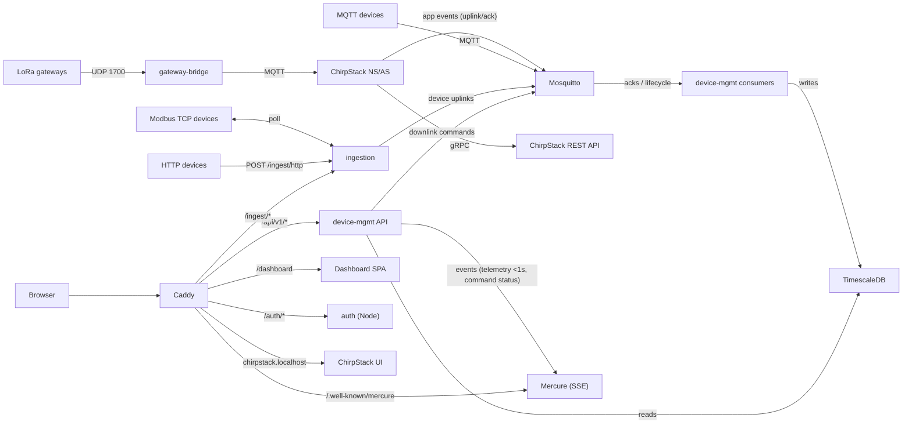

# Self-hosted IIoT Platform

[](https://github.com/nadimattari/iot-platform/actions/workflows/e2e.yml)

A single-tenant, self-hosted industrial IoT platform: connect, monitor, and
control devices over **MQTT, LoRaWAN, Modbus TCP, and HTTP/REST**, with live
dashboards, time-series insights, and command/downlink control.

Each customer deploys the full stack on their own VPS via Docker Compose.
There is no SaaS multi-tenancy.

## Status

**Feature-complete.** All 25 tasks across 6 phases (see
[`specs/iiot-platform-plan.md`](specs/iiot-platform-plan.md)) are implemented,
and the acceptance criteria (SC1–SC9) were validated on a Raspberry Pi 4
parity host running the production compose stack — see
[`docs/acceptance.md`](docs/acceptance.md). The E2E suite runs in CI on every
push and PR and currently passes **18/18 checks** (badge above).

The only remaining item is the **real-VPS confirmation run** (planned): a
repeat of the acceptance checklist on a live VPS with a real domain — external
HTTPS via Caddy auto-TLS, a dense load test, and the `git pull --ff-only`
upgrade path.

**What's implemented:**

- Multi-protocol ingestion (MQTT, Modbus TCP, LoRaWAN via ChirpStack v4/EU868,
  HTTP/REST) into TimescaleDB behind JWT auth, normalized to one telemetry model
- Telemetry read API (`/telemetry`, `/last`, `/status`) plus an insights API
  (`/insights/summary`, `/insights/timeseries`) over the 1m/1h/1d continuous
  aggregates
- Command/downlink API (`POST /devices/{id}/commands`) over MQTT and LoRaWAN
  confirmed downlinks, with `sent → acked` lifecycle tracking
- Real-time events over a Mercure SSE hub (per-device telemetry <1s, command
  status) — subscribers must present a JWT
- Vue 3 + PrimeVue dashboard at `/dashboard`: JWT login, live device list /
  detail views, telemetry charts, and insights pages
- Deployment hardening: healthchecks + log rotation on every container,
  TimescaleDB-aware backup/restore (`deploy/backup/`), and a provisioning +
  upgrade runbook (`deploy/runbook.md`)
- Full-stack E2E suite in CI (`.github/workflows/e2e.yml`) with mock devices
  for all four protocols, asserting ingest → TSDB → API → Mercure(SSE)

## Stack

| Container                        | Tech                            | Role                                                        |
|----------------------------------|---------------------------------|-------------------------------------------------------------|
| Caddy + Mercure                  | dunglas/mercure (Caddy 2 + SSE) | Edge reverse proxy, TLS, static SPA serving, SSE hub        |
| Auth                             | Node.js 22 + Fastify            | User management, JWT issue/refresh/revoke                   |
| Device management                | Symfony 7 + FrankenPHP          | Device/provisioning REST API, reads TSDB                    |
| Device-management consumers      | Symfony 7 (CLI)                 | Downlink / ACK event consumers (MQTT + ChirpStack)          |
| Ingestion                        | Python 3.12 + FastAPI           | MQTT subscribe, Modbus TCP poll, LoRaWAN, HTTP → TimescaleDB|
| Database                         | PostgreSQL 16 + TimescaleDB     | Relational + time-series                                    |
| Redis                            | Redis 7                         | Required by ChirpStack                                      |
| MQTT broker                      | Eclipse Mosquitto 2             | Shared device/ChirpStack bus                                |
| LoRaWAN NS/AS                    | ChirpStack v4 (EU868)           | Network Server + Application Server                         |
| Gateway bridge                   | ChirpStack gateway bridge v4    | UDP 1700 ⇄ MQTT for packet-forwarder gateways               |
| ChirpStack REST API              | chirpstack-rest-api v4          | REST facade over the ChirpStack gRPC API                    |
| Dashboard                        | Vue 3 + PrimeVue                | Live device views, charts, insights                         |
| E2E test profile (CI)            | Python + mock-modbus            | Mock devices for all 4 protocols + assertion suite          |

## Features

- **Device management** — register, provision, claim, enable/disable devices;
  per-device MQTT credentials with broker ACLs
- **Multi-protocol ingestion** — MQTT uplinks, Modbus TCP polling, LoRaWAN via
  ChirpStack, and HTTP/REST (JSON) pushes, normalized into one telemetry model
- **Data management** — telemetry in a TimescaleDB hypertable with continuous
  aggregates for insights (1m/1h/1d)
- **Application management** — live dashboard with real-time updates via
  Mercure (SSE), time-series charts, and insight pages
- **Command control** — downlinks for MQTT devices and LoRaWAN (via ChirpStack
  MQTT integration), with acknowledgement tracking
- **Authentication** — JWT via a dedicated Node auth service; stateless
  Ed25519 signature validation across services

## Architecture



Caddy is the only service reachable from the public internet (ports 80/443,
plus UDP 1700 for LoRaWAN gateways); the MQTT broker is never published, and
the database port is exposed only for local dev tooling (firewalled in
production). The `backend` compose network (`auth`, `device-mgmt`, its
consumers, `redis`, `mqtt`) is `internal: true` — nothing behind it is
published to the host.

## Repository Layout

```
specs/        → design spec + implementation plan (Tasks 1-25 checked)
deploy/       → compose files (prod stack + E2E test profile), Caddyfile, mqtt/,
                chirpstack/, mock-modbus/, backup/, runbook.md
services/     → auth (Node/Fastify), device-mgmt (Symfony), ingestion (Python), dashboard (Vue 3 SPA)
db/           → init scripts (databases, telemetry hypertable + continuous aggregates)
tests/        → e2e (full-stack suite, run in CI) + integration scaffold
docs/         → agent/IDE setup guides
```

## Getting Started

```bash
cp deploy/.env.example deploy/.env   # fill in secrets
docker compose -f deploy/docker-compose.yml up -d
```

- Dashboard: http://localhost/dashboard/ (root `/` redirects there)
- ChirpStack UI: `http://chirpstack.localhost` — add `127.0.0.1 chirpstack.localhost`
  to your hosts file, or set `CHIRPSTACK_SITE_ADDR`
- Admin login: the `AUTH_ADMIN_EMAIL` / `AUTH_ADMIN_PASSWORD` values from `deploy/.env`
  (seeded on first boot). ChirpStack UI logs in with the default **`admin` / `admin`**
  (ChirpStack v4 seeds it on first boot; change it in the UI or via `chirpstack set-password`)
- Operations: see [`deploy/runbook.md`](deploy/runbook.md) for DNS, firewall/ports,
  Caddy auto-TLS, backups, upgrades, and restore

### Local E2E suite

```bash
cp deploy/.env.example deploy/.env
docker compose -p iiot-platform-e2e -f deploy/docker-compose.yml \
  -f deploy/docker-compose.test.yml up --exit-code-from e2e
docker compose -p iiot-platform-e2e -f deploy/docker-compose.yml \
  -f deploy/docker-compose.test.yml down -v
```

This boots the whole stack in an isolated compose project with mock devices for
all four protocols and exits 0 on success (18 checks).

See the [spec](specs/iiot-platform.md) for objectives and success criteria,
and the [implementation plan](specs/iiot-platform-plan.md) for the 25-task breakdown across 6 phases.
