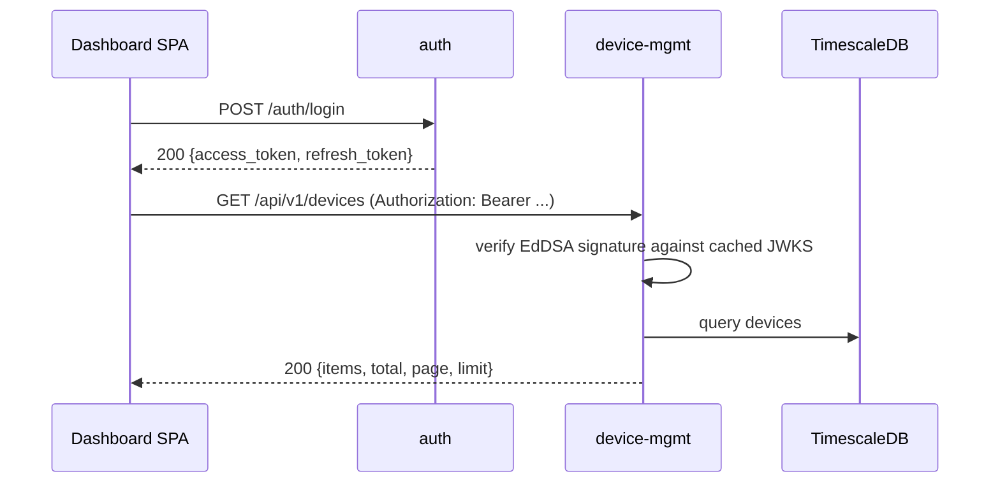

# IIoT Platform — API Reference

This document lists every HTTP endpoint exposed by the platform services. It
is organised by service. For how the pieces fit together, see
[Data flow](iiot-platform-data-flow.md); for authentication semantics, see
[Authentication](iiot-platform-auth.md).

## Conventions used in this document

- All endpoints are reachable through Caddy on the platform hostname. The
  paths below are the Caddy-visible paths.
- Unless stated otherwise, endpoints require a bearer access token:
  `Authorization: Bearer <access_token>`.
- Errors follow a consistent shape for device-mgmt and auth:

  ```json
  { "error": "message" }
  ```

- device-mgmt error status codes:

  | Status | Meaning |
  |--------|---------|
  | 400    | Malformed JSON body |
  | 401    | Missing/invalid token (`{"error": "unauthorized"}`) |
  | 404    | Resource not found |
  | 409    | Conflict (e.g. duplicate name/EUI) |
  | 422    | Validation error (`InvalidArgumentException`) |
  | 502    | Broker credential provisioning failed |

- Pagination: list endpoints accept `page` (default 1) and `limit` (default
  20, max 100).

---

## auth (Node/Fastify)

### `GET /health`

Public. Returns `{"status": "ok"}`.

### `GET /auth/jwks`

Public. Returns the Ed25519 public key used to verify access tokens:

```json
{ "keys": [ { "kty": "OKP", "crv": "Ed25519", "x": "...", "kid": "...", "use": "sig", "alg": "EdDSA" } ] }
```

### `POST /auth/login`

Authenticates an admin/user and returns a fresh token pair.

Request:

```json
{ "email": "admin@example.com", "password": "secret" }
```

Responses:

| Status | Body |
|--------|------|
| 200    | `{"access_token": "...", "refresh_token": "...", "user": {"id", "email", "role"}}` |
| 400    | `{"error": "invalid_request"}` |
| 401    | `{"error": "invalid_credentials"}` |

### `POST /auth/refresh`

Rotates a refresh token. Reusing a revoked token revokes the whole family.

Request: `{"refresh_token": "..."}`

| Status | Body |
|--------|------|
| 200    | `{"access_token": "...", "refresh_token": "..."}` |
| 400    | `{"error": "invalid_request"}` |
| 401    | `{"error": "reused_token"}` (revoked or expired) |
| 401    | `{"error": "invalid_token"}` (unknown token) |

### `POST /auth/logout`

Revokes the presented refresh token (idempotent). Request: `{"refresh_token": "..."}`. Returns `204` on success.

### `GET /auth/me`

Bearer required. Returns the caller's identity from the JWT claims (no
database lookup): `{"id", "email", "role"}`. `401` without a valid token.

### `GET /auth/mercure-token`

Bearer required. Returns a JWT that authorises SSE subscriptions on
`/devices/{id}`:

| Status | Body |
|--------|------|
| 200    | `{"mercure_token": "...", "expires_in": 3600}` |
| 401    | `{"error": "unauthorized"}` |
| 503    | `{"error": "mercure_not_configured"}` (subscriber key unset) |

---

## ingestion (Python/FastAPI)

### `POST /ingest/http/{device_id}`

HTTP device uplink. Authenticated with the header
`X-API-Key: <device api key>` (not a bearer token).

Request body: JSON object of field → value pairs (plus optional `time` in
ISO-8601).

| Status | Body / meaning |
|--------|----------------|
| 202    | `{"accepted": true, "points": <n>}` — accepted for async write |
| 401    | `{"error": {"code": "UNAUTHORIZED", "message": "invalid device credentials"}}` |
| 413    | `{"error": {"code": "PAYLOAD_TOO_LARGE", "message": ...}}` — body over 64 KiB |
| 422    | `{"error": {"code": ..., "message": ..., "details": ...}}` — not a JSON object, profile-schema violation, or normalisation failure |

### `GET /health`

Public. Returns `{"status": "ok", "db": "connected" | "unavailable"}`.

---

## device-mgmt (Symfony), prefix `/api/v1`

### `GET /api/v1/health`

Public (the only unauthenticated device-mgmt route). Returns service health.

### `GET /api/v1/auth/me`

Bearer required. Returns `{"id", "email", "role"}` from the verified token.

### Devices

#### `GET /api/v1/devices`

Query: `protocol` (`mqtt` | `http` | `modbus` | `lorawan`), `page`, `limit`.

Response: `{"items": [<device>], "total": n, "page": n, "limit": n}`.

#### `POST /api/v1/devices`

Request:

```json
{
  "name": "temp-sensor-1",
  "protocol": "mqtt",
  "group_id": "optional-uuid",
  "metadata": { "anything": "you like" }
}
```

Response `201`: `{"device": <device>, "api_key": "<key>"}`. The `api_key`
is present for `mqtt`, `http` and `modbus` devices (the same key is the
device's MQTT broker password); it is returned **only once** and is not
recoverable — store it.

#### `GET /api/v1/devices/{id}`

Response: `{"device": <device>}`.

#### `PUT /api/v1/devices/{id}`

Request (any subset): `{"name", "group_id", "metadata"}`. Response:
`{"device": <device>}`.

#### `PATCH /api/v1/devices/{id}`

Request: `{"enabled": true|false}` — enable/disable a device. Response:
`{"device": <device>}`.

#### `DELETE /api/v1/devices/{id}`

Returns `204`. Also revokes the device's MQTT credential.

#### `POST /api/v1/devices/{id}/claim`

Claims a device to a LoRaWAN EUI (or issues credentials for non-LoRaWAN
devices). Request: `{"dev_eui": "70b3d5499e320001"}` (16 hex chars, required
for LoRaWAN). Response: `{"device": <device>, "api_key": "<key>"?}`.

#### `POST /api/v1/devices/{id}/downlink`

LoRaWAN downlink (legacy endpoint; the unified commands endpoint below is
preferred). Request: `{"f_port": 10, "confirmed": false, "data": "<base64>", "object": {...}}`
— exactly one of `data`/`object`. Response `201`: `{"command": <command>}`.

### Modbus registers

#### `GET /api/v1/devices/{id}/registers`

Response: `{"registers": [<register>, ...]}`.

#### `PUT /api/v1/devices/{id}/registers`

**Replaces** the full register set for the device. Request:

```json
{
  "registers": [
    { "name": "temperature", "address": 0, "datatype": "float32", "byteorder": "big", "scale": 1.0, "interval_secs": 2 }
  ]
}
```

`byteorder` is one of `big`, `little`, `byte_swap`, `byte_word_swap`; `datatype`
one of `uint8`, `int8`, `uint16`, `int16`, `uint32`, `int32`, `float32`,
`float64`. Duplicate names are rejected. Response: `{"registers": [...]}`.

### Commands

#### `POST /api/v1/devices/{id}/commands`

Sends a command over the device's transport. LoRaWAN request uses
`{"f_port", "confirmed", "data" | "object"}`; MQTT request uses
`{"payload": {...}}`. Response `201`: `{"command": <command>}`. The command
starts in status `pending`.

#### `GET /api/v1/commands`

Query: `device_id`, `status` (`pending` | `sent` | `acked` | `failed`),
`page`, `limit`. Response:

```json
{ "items": [<command>], "total": n, "page": n, "limit": n }
```

### Telemetry

#### `GET /api/v1/devices/{id}/telemetry`

Query: `from` (default `-24 hours`), `to` (default `now`), `resolution`
(`1s` | `15s` | `1m` | `5m` | `15m` | `1h` | `1d`, default `1m`).

Response:

```json
{
  "points": [ { "bucket": "ISO-8601", "field": "temperature", "min": 0, "max": 0, "avg": 0, "count": 0 } ],
  "meta": { "device_id": "...", "from": "...", "to": "...", "resolution": "1m" }
}
```

#### `GET /api/v1/devices/{id}/last`

Latest value per field. Response:

```json
{ "last": { "temperature": { "value": 22.9, "time": "...", "type": "float", "quality": 0 } } }
```

#### `GET /api/v1/devices/{id}/status`

Online status derived from `last_seen` and the device's `heartbeat_secs`
metadata (default 300). Response:

```json
{
  "device_id": "...", "name": "...", "protocol": "mqtt",
  "enabled": true, "last_seen": "ISO-8601|null",
  "heartbeat_secs": 300, "online": true
}
```

### Insights (continuous-aggregate rollups)

#### `GET /api/v1/insights/summary`

Query: `group_id` (required), `from` (default `-30 days`), `to`. Per-field
summary across the whole group from the `1d` aggregate. Response:

```json
{ "group_id": "...", "bucket": "1d", "from": "...", "to": "...", "fields": [ { "field", "min", "max", "avg", "count" } ] }
```

#### `GET /api/v1/insights/timeseries`

Query: `device_id` (required), `bucket` (`1m` | `1h` | `1d`, default `1m`),
`from` (default `-24 hours`), `to`. Response:

```json
{ "device_id": "...", "bucket": "1m", "from": "...", "to": "...", "items": [ { "bucket", "field", "min", "max", "avg", "count" } ] }
```

### Groups

#### `GET /api/v1/groups`

Response: `{"items": [ { "id", "name", "device_count", "created_at" } ], "total": n}`
sorted by name. (Group creation is done through the dashboard's device
creation flow using `metadata.group` — see the design spec.)

## Data shapes

**Device:**

```json
{ "id": "uuid", "name": "temp-sensor-1", "protocol": "mqtt", "group_id": "uuid|null",
  "dev_eui": "70b3d5499e320001|null", "metadata": {}, "enabled": true,
  "last_seen_at": "ISO-8601|null", "created_at": "ISO-8601" }
```

**Command:**

```json
{ "id": "uuid", "device_id": "uuid", "type": "mqtt_message", "status": "pending",
  "payload": {}, "confirmed": false, "f_port": 10, "queue_item_id": "uuid|null",
  "error": "string|null", "created_at": "...", "updated_at": "..." }
```

**Register:**

```json
{ "name": "temperature", "address": 0, "datatype": "float32", "byteorder": "big", "scale": 1.0, "interval_secs": 2 }
```

## Example: an authenticated request


