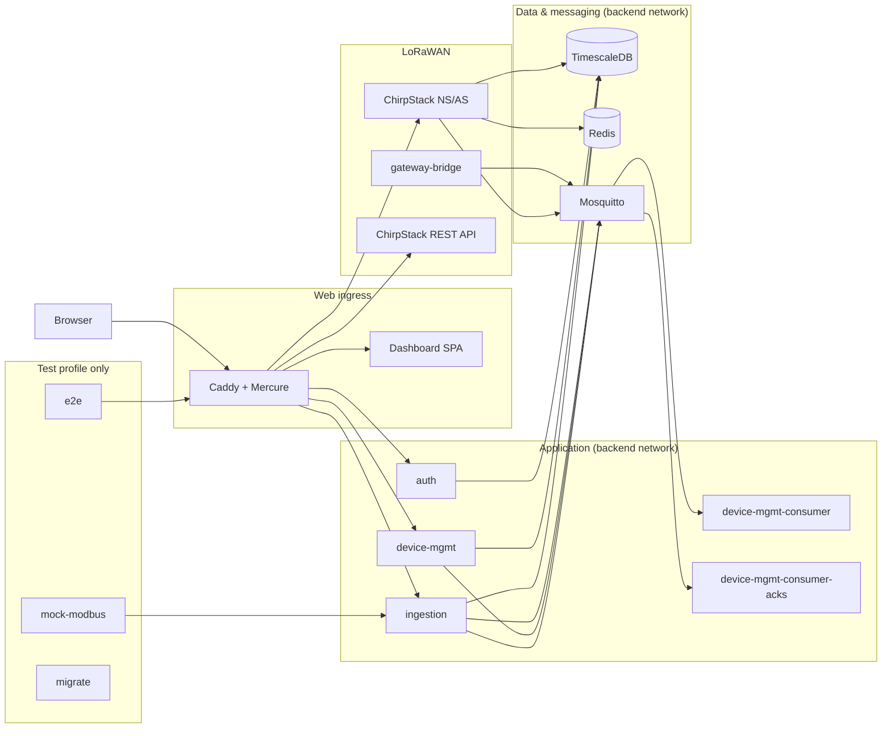

# IIoT Platform — Architecture

This document describes how the platform is put together: its components,
networks, ports, routing and process model. See
[`specs/README.md`](README.md) for the reading order.

## Component diagram

The platform runs as a Docker Compose stack. The deployment unit is a single
host (VPS or edge device — see [Hosting](iiot-platform-hosting.md)). It
contains fifteen services grouped by concern:

## Networks

Two Docker bridge networks are defined in
[`deploy/docker-compose.yml`](../deploy/docker-compose.yml):

| Network    | Driver | Internal | Purpose |
|------------|--------|----------|---------|
| `frontend` | bridge | no       | Published ports and the reverse proxy. Only Caddy-facing services attach here. |
| `backend`  | bridge | **yes**  | Everything else. No container on this network can reach the host or the internet. |

`internal: true` means the network has no external connectivity — Docker
rejects any `ports:` mapping on it. Services on it talk only to each other.

Which network each service attaches to:

| Service                  | `frontend` | `backend` | Published host ports |
|--------------------------|:----------:|:---------:|----------------------|
| `caddy`                  | yes        | yes       | `80`, `443`          |
| `dashboard`              | yes        | —         | —                    |
| `auth`                   | —          | yes       | —                    |
| `device-mgmt`            | —          | yes       | —                    |
| `device-mgmt-consumer`   | —          | yes       | —                    |
| `device-mgmt-consumer-acks` | —       | yes       | —                    |
| `ingestion`              | yes        | yes       | —                    |
| `db`                     | yes        | yes       | `5432` (dev only — see note) |
| `redis`                  | —          | yes       | —                    |
| `mqtt`                   | —          | yes       | —                    |
| `chirpstack`             | yes        | yes       | `8080`               |
| `chirpstack-gateway-bridge` | yes     | yes       | `1700/udp`           |
| `chirpstack-rest-api`    | yes        | yes       | `8090`               |
| `migrate`, `mock-modbus`, `e2e` (test) | varies | yes | — |

Published ports:

| Port       | Service                      | Why                                   |
|------------|------------------------------|---------------------------------------|
| `80/443`   | `caddy`                      | Internet-facing web entry point       |
| `1700/udp` | `chirpstack-gateway-bridge`  | LoRaWAN packet forwarder from gateways |
| `8080`     | `chirpstack`                 | ChirpStack web UI / gRPC-web          |
| `8090`     | `chirpstack-rest-api`        | ChirpStack REST facade                |
| `5432`     | `db`                         | Dev tooling only — firewalled or removed in production |

> The `mqtt` broker has **no** published port. All MQTT traffic stays on the
> `backend` network. In production, remove the `5432`, `8080` and `8090`
> `ports:` entries — see [Deployment](iiot-platform-deployment.md).

## Caddy routing

Caddy is the single entry point. The file
[`deploy/caddy/Caddyfile`](../deploy/caddy/Caddyfile) defines two sites.

Site 1 — `{$SERVER_NAME}` (the platform hostname, default `:80`):

| Route                  | Target                   | Notes |
|------------------------|--------------------------|-------|
| `GET /healthz`         | —                        | Liveness probe, returns 200 |
| `/`                    | redirect to `/dashboard/`| Root redirect |
| `/auth/*`              | `auth:3000`              | Auth API |
| `/api/v1/*`            | `device-mgmt:80`         | Device-mgmt REST API |
| `/ingest/*`            | `ingestion:8000`         | HTTP ingestion |
| `/dashboard*`          | `dashboard:80`           | SPA (prefix stripped) |
| `/.well-known/mercure` | Mercure hub              | SSE hub (imported Mercure Caddyfile) |
| fallback               | 404                      |                       |

Site 2 — `{$CHIRPSTACK_SITE_ADDR}` (default `http://chirpstack.localhost`):

| Route | Target             | Notes |
|-------|--------------------|-------|
| any   | `chirpstack:8080`  | ChirpStack UI. Needs a hosts entry or DNS record for the hostname. |

ChirpStack gets its own hostname because v4 hard-codes `/`, `/static` and
`/logo` and cannot run under a sub-path.

The Mercure hub (`deploy/caddy/mercure/Caddyfile`) is imported into site 1. It
requires a JWT for every subscriber (no anonymous access), separates the
publisher and subscriber keys, sends a heartbeat every 30 s, and persists event
history in a Bolt DB so clients can resume via Last-Event-ID.

## Runtime model per service

| Service | Process | Entry |
|---------|---------|-------|
| `auth` | Single Node process | `node dist/index.js` — Fastify HTTP API on `:3000`, runs DB migrations (`auth` schema) and seeds the admin user at boot |
| `device-mgmt` | FrankenPHP (PHP 8.4) with embedded Caddy | `frankenphp run` — serves the Symfony app over HTTP on `:80` (PHP worker model) |
| `device-mgmt-consumer` | Long-running console command | `bin/console app:consume-downlink-events` — MQTT subscriber for ChirpStack `event/ack` + `event/txack` |
| `device-mgmt-consumer-acks` | Long-running console command | `bin/console app:consume-mqtt-acks` — MQTT subscriber for `devices/+/ack` |
| `ingestion` | Single Python process (asyncio) | `uvicorn app.main:app` — FastAPI on `:8000`; also owns the MQTT subscriber task, the Modbus poller task and the batch writer task |
| `dashboard` | Static nginx serving the built SPA | SPA `try_files` fallback; assets cached `7d` immutable |
| `db` | TimescaleDB 16 (PostgreSQL) | `docker-entrypoint` runs `db/init/*` scripts on first boot |
| `redis` | Redis 7 | `redis-server` |
| `mqtt` | Mosquitto 2 | `/mosquitto/entrypoint.sh` seeds service accounts, watches the credential file and reloads the broker with `SIGHUP` |
| `chirpstack` | ChirpStack v4 | Merges every TOML in `/etc/chirpstack`, gRPC/API on `:8080`, monitoring on `:8081` |
| `chirpstack-gateway-bridge` | gateway-bridge v4 | UDP 1700 packet forwarder ↔ MQTT (`eu868/gateway/...`) |
| `chirpstack-rest-api` | REST facade | `--server chirpstack:8080 --bind 0.0.0.0:8090` (gRPC → REST, unencrypted on the internal network) |

Two of these run more than one task inside one process:

- **`ingestion`** — the FastAPI web server, the MQTT subscriber, the Modbus
  poller and the batch writer all live in the same container but as separate
  asyncio tasks, supervised so a crash in one is logged and retried.
- **`device-mgmt`** — the web API container; the two consumers are separate
  containers reusing the same image and entrypoint commands.

## Data path summary

Four protocol inputs converge on `ingestion`, which normalises everything
into `TelemetryPoint` rows, batches them (≤ 500 or 0.2 s) and writes them with
a single `COPY` transaction into TimescaleDB. After a successful flush it
publishes one Mercure SSE event per device, so the dashboard updates in under
a second. `device-mgmt` reads the same tables for the REST API and insights.
Downlinks go the other way: `device-mgmt` publishes to Mosquitto (MQTT
devices) or to the ChirpStack MQTT integration (LoRaWAN), and the consumers
match acks back to the originating command row.

The detailed flows are in [Data flow](iiot-platform-data-flow.md).

## Where the state lives

| State | Location |
|-------|----------|
| Users, refresh tokens | `iiot` DB, `auth` schema |
| Devices, groups, profiles, Modbus config, commands | `iiot` DB, `public` schema |
| Telemetry points, raw payloads, aggregates | `iiot` DB, `telemetry` schema |
| LoRaWAN devices, applications, queue items | `chirpstack` DB (separate database) |
| MQTT sessions, retained messages | Mosquitto persistence files (`mqtt_data` volume) |
| MQTT user/password database | `/mosquitto/creds/mosquitto.passwd` |
| Auth signing keys | `auth_keys` volume (`/keys`) |
| Mercure event history | `mercure_data` volume (Bolt DB) |

See [Database ERD](iiot-platform-erd.md) for the full schema.
