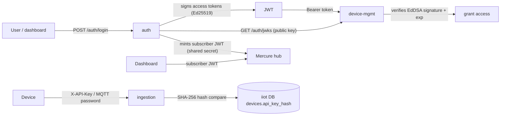
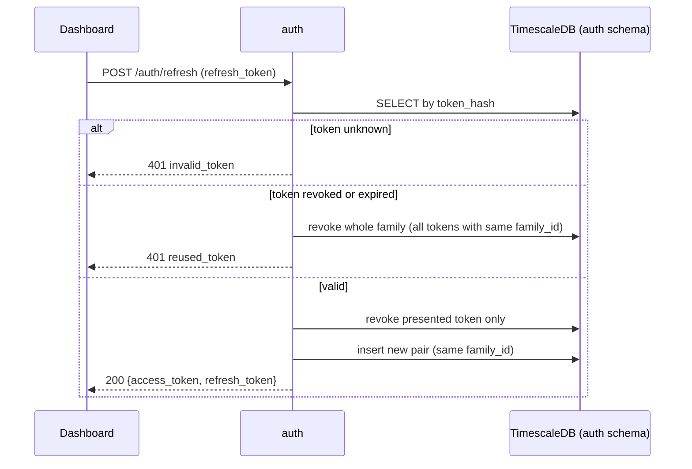

# IIoT Platform — Authentication and Authorisation

This document explains how identity works across the platform: how users log
in, how tokens are signed and verified, how refresh tokens rotate, and how
devices authenticate. The endpoint reference lives in
[API reference](iiot-platform-api.md).

## Overview of who trusts what

There are **three separate credential systems**:

1. **User access tokens** — signed by `auth` with Ed25519, verified statelessly
   by `device-mgmt` against the public key from JWKS. No per-request calls
   back to `auth`.
2. **Mercure subscriber tokens** — HS256 JWTs minted by `auth` with a shared
   secret, verified by the Mercure hub (in Caddy). Used by the dashboard to
   subscribe to SSE streams.
3. **Device credentials** — each non-LoRaWAN device gets an API key (also its
   MQTT broker password). Verified by `ingestion` for HTTP uploads and by
   Mosquitto for MQTT connections.

## User authentication

### Login

`POST /auth/login` with `email` + `password`. `auth` verifies the password
with bcrypt (cost factor 12), then returns:

- an **access token** — an EdDSA-signed JWT valid for 15 minutes
  (`AUTH_ACCESS_TTL_MINUTES`), claims: `sub` (user id), `email`, `role`,
  `iat`, `exp`;
- a **refresh token** — a 256-bit random value, not a JWT, valid for 30 days
  (`AUTH_REFRESH_DAYS`); stored only as its SHA-256 hash.

### Refresh-token rotation

Key points:

- Every token carries a `family_id` created at first login. On refresh, the
  presented token is revoked and a new pair is issued **in the same family**.
- If a rotated-out token is ever presented again — or an expired one is — the
  **entire family is revoked**. A single stolen token therefore cannot be
  replayed: the first refresh invalidates everything.
- `POST /auth/logout` revokes only the single presented token (idempotent).

### Stateless verification in device-mgmt

`device-mgmt` does not talk to `auth` per request. It:

1. fetches `GET /auth/jwks` (default `http://auth:3000/auth/jwks`) once and
   caches it (`auth.jwks`, TTL default 3600 s — so key rotation is picked up
   within one TTL);
2. verifies the Bearer token with an EdDSA-only JWS verifier against that key
   set, checks `exp`, and requires a `sub` claim;
3. builds the user identity from `sub`/`email`/`role`.

The firewall allows `/api/v1/health` unauthenticated; everything else under
`/api/v1` requires a valid token.

### Signing keys

- Keys are Ed25519 (EdDSA), generated on first boot and persisted in the
  `auth_keys` volume (`/keys`) as `private.pem`/`public.pem`, permissions
  `0600`. They can also be injected as PEM environment variables.
- The `kid` is the RFC 7638 thumbprint of the public key, so rotating the
  PEM files changes the `kid` automatically.
- Only `auth` holds the private key; the dashboard never sees it.

### Seeded admin

On every boot `auth` runs `INSERT ... ON CONFLICT (email) DO NOTHING` with
`AUTH_ADMIN_EMAIL`/`AUTH_ADMIN_PASSWORD` — an existing admin password is never
overwritten. The role is `admin`.

## Mercure (SSE) tokens

`GET /auth/mercure-token` returns an HS256 JWT signed with the shared
`MERCURE_SUBSCRIBER_JWT_KEY`, with claim
`{"mercure": {"subscribe": ["/devices/{id}"]}}`, valid 3600 s. The browser
never sees the secret — the dashboard requests the token through `auth`, then
passes it to the SSE hub. The hub requires a JWT for every subscription (no
anonymous access).

Separately, `ingestion` and `device-mgmt` **publish** SSE events using their
own short-lived per-topic HS256 JWTs signed with `MERCURE_PUBLISHER_JWT_KEY` —
a different secret, so publishers and subscribers are strictly separated.

## Device credentials

| Protocol | How the device authenticates | Where it is verified |
|----------|------------------------------|----------------------|
| MQTT     | username = device id, password = API key | Mosquitto (`mosquitto.passwd`) |
| HTTP     | header `X-API-Key: <api key>` | ingestion (constant-time hash compare) |
| Modbus   | (polled by the platform — no device credential) | — |
| LoRaWAN  | device identity is `dev_eui` claimed in device-mgmt; radio crypto handled by ChirpStack | ingestion resolves EUI → device id |

Lifecycle of a device API key:

1. On `POST /api/v1/devices` (for `mqtt`/`http`/`modbus`), device-mgmt
   generates a key `dk_` + 32 random bytes (base64url). Only the SHA-256 hex
   hash is stored in `devices.api_key_hash`.
2. The plaintext key is returned **exactly once** in the create (and claim)
   response, together with a Mosquitto broker credential provisioned with the
   same value (device id as username).
3. The broker's entrypoint watches the password file and reloads Mosquitto
   (`SIGHUP`) the moment device-mgmt writes it, so new devices can connect
   immediately.
4. Deleting a device revokes its broker credential.
5. Because only the hash is stored, the key cannot be recovered later — keep
   it or rotate by creating a fresh device.

## Where secrets live

| Secret | Storage |
|--------|---------|
| User passwords | bcrypt hash, `auth.users.password_hash` |
| Refresh tokens | SHA-256 hash, `auth.refresh_tokens.token_hash` |
| Device API keys | SHA-256 hash, `devices.api_key_hash` |
| Ed25519 signing key | `auth_keys` volume, `0600`, inside `auth` only |
| Mercure publisher/subscriber secrets | `deploy/.env`, shared with Caddy |
| MQTT passwords | `deploy/.env` + `mosquitto.passwd` |

See [Security](iiot-platform-security.md) for the network and hardening model.
