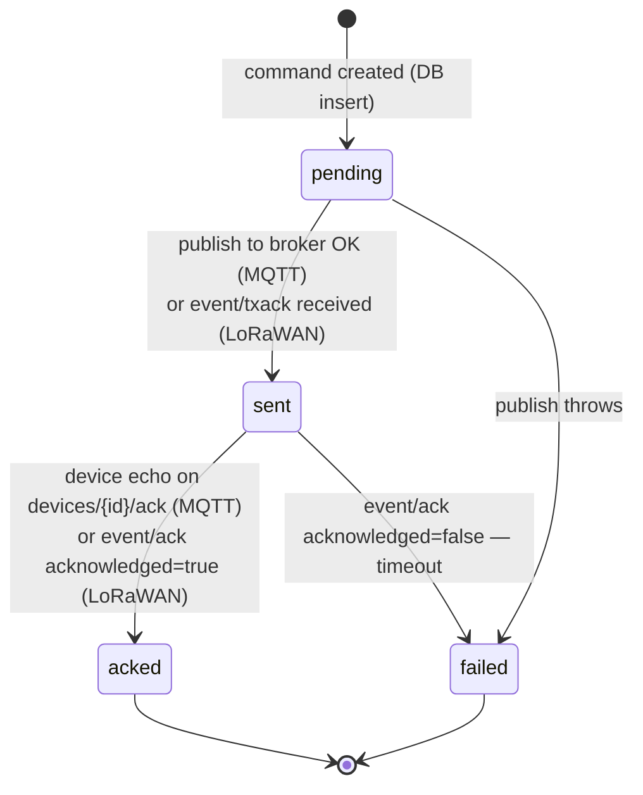
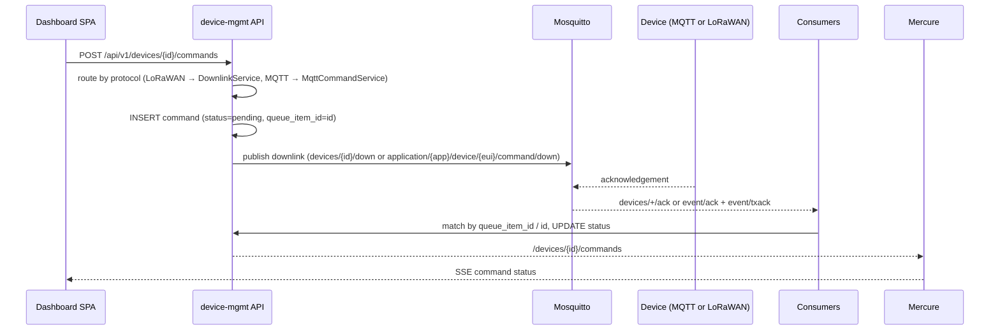

# IIoT Platform — Command and Downlink Lifecycle

This document describes how commands (downlinks) are sent to devices and how
their lifecycle is tracked. The API entry points are in
[API reference](iiot-platform-api.md); the end-to-end flow is in
[Data flow](iiot-platform-data-flow.md).

## The command row

Every command is stored in the `commands` table (see
[Database ERD](iiot-platform-erd.md)). Key fields:

| Field | Meaning |
|-------|---------|
| `type` | `lorawan_downlink` or `mqtt_message` |
| `status` | `pending` → `sent` → `acked` \| `failed` |
| `payload` | The command payload (JSON) |
| `confirmed` | LoRaWAN: whether a radio acknowledgement is required |
| `f_port` | LoRaWAN FPort (default 10) |
| `queue_item_id` | The command UUID, which doubles as the ChirpStack queue-item id |
| `error` | Failure reason (null until failed) |

The command UUID is also the correlation id used on the wire: for MQTT it is
published as `id` in the downlink payload and echoed back by the device; for
LoRaWAN it is published as `id` in the ChirpStack command and echoed back by
ChirpStack as `queueItemId` in `event/ack`/`event/txack`.

## Status machine

Details:

- **`pending`** — the default on creation (`Command::__construct`).
- **`pending → sent`**:
  - MQTT: the publish to `devices/{id}/down` succeeded;
  - LoRaWAN: a ChirpStack `event/txack` arrives — the gateway accepted the
    frame for radio transmission. A `txack` only promotes a still-pending
    command; it never downgrades an already-acked one.
- **`pending → failed`**: the MQTT publish threw; the error message is stored.
- **`sent → acked`**:
  - MQTT: the device echoed the command id on `devices/{id}/ack`; any stored
    error is cleared;
  - LoRaWAN: `event/ack` with `acknowledged=true`.
- **`sent → failed`**: LoRaWAN `event/ack` with `acknowledged=false`
  (the device did not acknowledge within the timeout) — the error is set to
  `"Device did not acknowledge the downlink (timeout)."`.

## Who does what

Two long-running consumers perform the status updates:

- **`device-mgmt-consumer`** (`app:consume-downlink-events`) subscribes to
  `application/{application_id}/device/+/event/ack` and
  `application/{application_id}/device/+/event/txack` — the ChirpStack event
  topics. It matches commands by `queueItemId`.
- **`device-mgmt-consumer-acks`** (`app:consume-mqtt-acks`) subscribes to
  `devices/+/ack` — the device echo topic. It matches commands by the echoed
  `id`.

Unknown ids are ignored.

## Every status change is published

A Doctrine `onFlush`/`postFlush` listener collects created/updated `Command`
rows and publishes each change to the Mercure topic
`/devices/{deviceId}/commands` with the serialised command, so the dashboard
updates live without polling.

## Unsupported paths

- Commands for `http`, `modbus` and (unclaimed) `lorawan` devices are
  rejected with `422` — only `mqtt` and claimed `lorawan` devices support
  downlinks.
- MQTT commands require a non-empty `payload` object in the request body.

See [Commands API](iiot-platform-api.md#commands) for the request formats.
