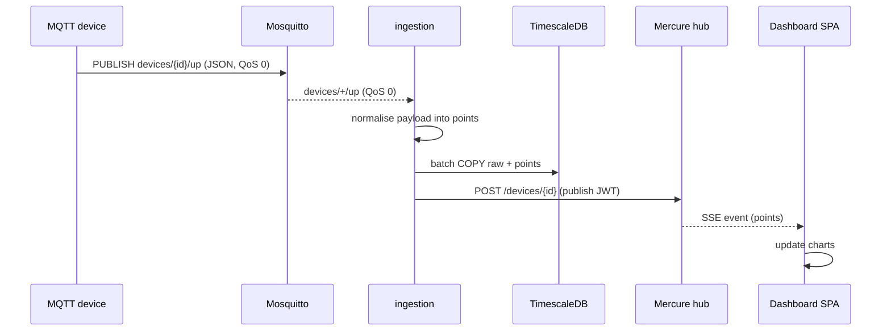
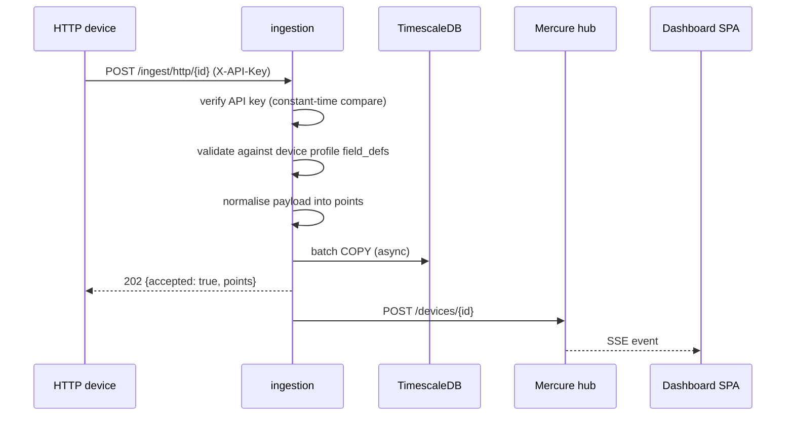
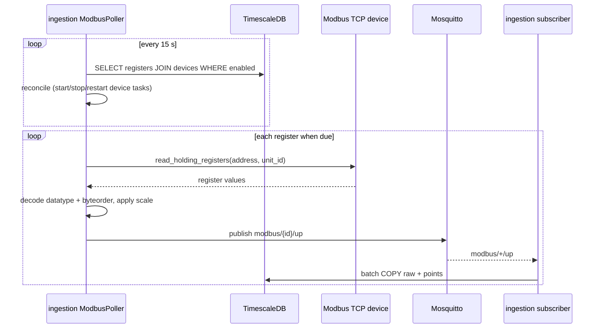
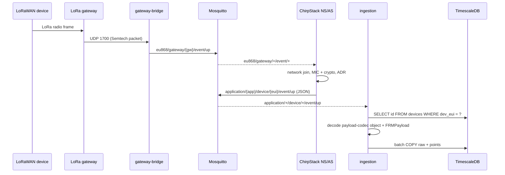
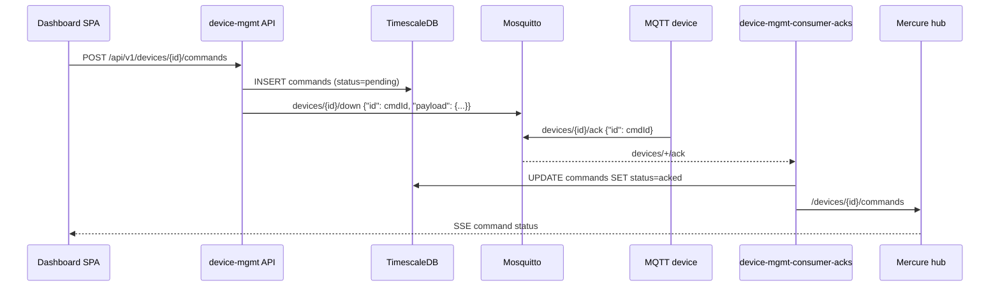
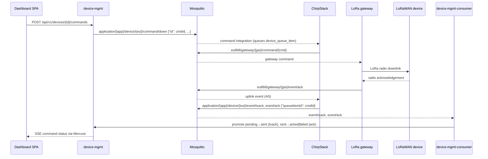

# IIoT Platform — Data Flow

This document walks through the five end-to-end flows of the platform: four
uplink paths (MQTT, HTTP, Modbus TCP, LoRaWAN) and the downlink/command path.
For the database shapes, see [Database ERD](iiot-platform-erd.md); for the
full API surface, see [API reference](iiot-platform-api.md).

## Shared pipeline

All four uplink paths converge on the `ingestion` service, which treats every
incoming message the same way:

1. **Normalise** — turn the raw payload into a list of `TelemetryPoint` rows
   (`time`, `device_id`, `field`, `value`, `type`, `quality`).
2. **Enqueue** — push the uplink onto a bounded `asyncio.Queue`
   (max 10,000 items; `put()` blocks when full, providing backpressure).
3. **Batch & write** — the writer task collects items until 500 or 0.2 s has
   elapsed, then inserts them in **one transaction** using `COPY` into
   `telemetry.telemetry_raw` and `telemetry.telemetry_points`.
4. **Publish** — after a successful flush, one Mercure SSE event per device is
   pushed to the dashboard. A failure here is logged but never blocks the
   pipeline.

Unknown or malformed messages are dropped (quarantined) with a warning, never
crash the service.

---

## 1. MQTT uplink

An MQTT device authenticates with its device id as username and its API key as
password, and publishes JSON to `devices/{device_id}/up`.

Notes:

- The broker ACL confines each device to `devices/<its-id>/#` — a device can
  only ever read/write its own topic subtree.
- The payload must be a JSON object. Every key except `time` is treated as a
  field; booleans, integers, floats and numeric strings become points; nested
  objects and non-numeric strings are skipped.
- `time` is optional; if absent the ingestion timestamp is used. Naive
  timestamps are assumed UTC.

---

## 2. HTTP uplink

An HTTP device sends a JSON body to `POST /ingest/http/{device_id}` with the
header `X-API-Key: <api key>`.

Notes:

- The API key is verified with a constant-time comparison
  (`hmac.compare_digest`) against the device's stored SHA-256 hash. If the
  key is wrong, or the device has none, the request is rejected with 401.
- The body is validated against the device's profile (`metadata.profile_id` →
  `device_profiles.field_defs`): required fields and types are enforced.
- Bodies are capped at 64 KiB (413 if larger).
- The response is `202 Accepted` immediately; the write happens asynchronously
  in the next batch.

---

## 3. Modbus TCP uplink

Modbus devices are **polled** by the ingestion service — they do not push.
The poller reads the Modbus register configuration from the `iiot` database
every 15 s (so changes apply without a restart), then schedules each register
at its own `interval_secs` cadence.

Notes:

- Each device gets its own polling task, so a hung PLC only stalls itself.
- Reading is wrapped in a timeout (default 5 s); a timeout is logged and the
  next read happens on schedule.
- Register decoding supports `uint8`/`int8`/`uint16`/`int16`/`uint32`/`int32`/
  `float32`/`float64` and four byte orders (`big`, `little`, `byte_swap`,
  `byte_word_swap`). The decoded value is multiplied by the register's `scale`
  factor.
- The sample is published back through the broker on `modbus/{id}/up` so it
  flows through the same normalise → batch → publish pipeline as every other
  protocol (protocol is recorded as `modbus`).

---

## 4. LoRaWAN uplink

LoRaWAN sensors join the network through a gateway. The path from radio to
database crosses several components, all mediated by MQTT:

Notes:

- The gateway talks Semtech UDP to `chirpstack-gateway-bridge` on port
  1700/udp; the bridge republishes the frames as MQTT messages on
  `eu868/gateway/...`.
- ChirpStack's application server re-publishes each uplink as a JSON event on
  `application/{application_id}/device/{dev_eui}/event/up`.
- The ingestion service subscribes to that pattern, extracts the `dev_eui`
  from the topic, and resolves it to a platform device id with a direct
  database query (`SELECT id FROM devices WHERE LOWER(dev_eui) = LOWER($1)`).
  An EUI that is not claimed by any device is quarantined (dropped with a
  warning).
- Decoded fields come from the device profile's payload-codec output (the
  `object` envelope key); the raw FRMPayload is stored base64-decoded in
  `telemetry.telemetry_raw.raw` for replay and audit.
- The e2e suite emulates this whole path with a simulated gateway and device
  (`deploy/chirpstack/scripts/lorasim.py`).

---

## 5. Downlink (commands)

Commands travel the opposite direction. The dashboard calls the device-mgmt
API; device-mgmt records the command and publishes it; consumers match the
device's (or ChirpStack's) acknowledgement back to the command row and update
its status. The status machine is documented in
[Commands](iiot-platform-commands.md); here are the two transport paths.

### MQTT device

The command UUID is published in the downlink payload as `id`; the device
echoes it back verbatim on its ack topic, so the consumer can find the exact
command row.

### LoRaWAN device

Notes:

- For LoRaWAN the **command UUID doubles as the ChirpStack queue-item id**:
  device-mgmt publishes it in the downlink payload and ChirpStack stores it on
  the queue item; the `event/ack` messages echo it back as `queueItemId`, so
  the consumer can match it without any extra lookup table.
- A `txack` (the gateway accepted the frame for radio transmission) promotes
  a still-pending command to `sent`; an `ack` with `acknowledged: true` marks
  it `acked`, and `acknowledged: false` (timeout) marks it `failed`.
- Every status change is published to the dashboard on
  `/devices/{id}/commands`.

---

## Failure behaviour

| Step | Failure | Behaviour |
|------|---------|-----------|
| MQTT consume | broker unreachable | subscriber reconnects after 1 s; buffered messages are lost (QoS 0) |
| Normalise | malformed payload / unknown device | logged and quarantined; pipeline continues |
| DB write | database error | the whole batch is dropped and logged (not retried) |
| Mercure publish | hub unreachable | logged and swallowed; telemetry is never lost because of the hub |
| Modbus read | PLC timeout | logged; next read on schedule |
| Downlink publish | broker error | command marked `failed` with the error message |
