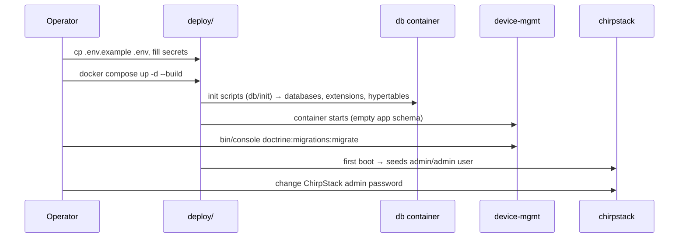
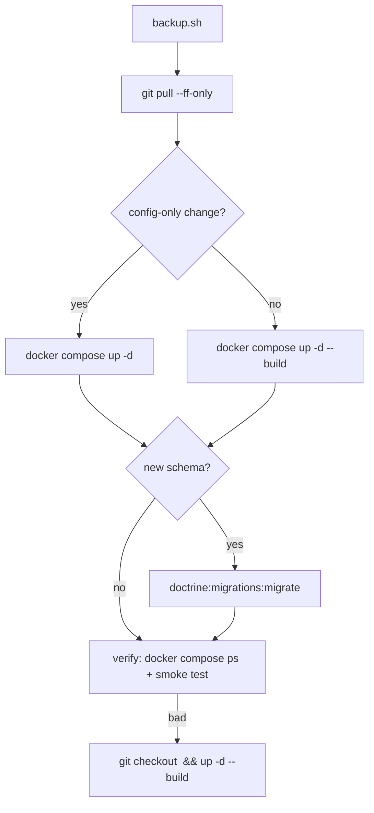

# IIoT Platform — Deployment

This document covers the deployment model, bootstrapping, backups, upgrades
and recovery. The exact commands live in the
[runbook](../deploy/runbook.md); here we record the architecture of the
deployment itself.

## Deployment model

The whole platform ships as **one Docker Compose project** (`deploy/`) and
runs on a single host. There are 15 services: 7 product containers (Caddy,
auth, device-mgmt, device-mgmt-consumer, device-mgmt-consumer-acks,
ingestion, dashboard), 5 infrastructure containers (db, redis, mqtt,
chirpstack, chirpstack-rest-api, chirpstack-gateway-bridge) and the two
networks that separate them:

```mermaid
flowchart TB
    subgraph frontend["frontend network (bridge)"]
        CAD[Caddy + Mercure]
        DASH[dashboard]
        DB["db / TimescaleDB"]
        ING[ingestion]
        CH[chirpstack]
        GWB[gateway-bridge]
        RAPI[chirpstack-rest-api]
    end
    subgraph backend["backend network (internal: true)"]
        AUTH[auth]
        DM[device-mgmt]
        C1[device-mgmt-consumer]
        C2[device-mgmt-consumer-acks]
        MQ[mqtt]
        RD[redis]
        ING2[ingestion]
        CH2[chirpstack]
        GWB2[gateway-bridge]
        RAPI2[chirpstack-rest-api]
        DB2[db]
        CAD2[Caddy]
    end
    INTERNET[Internet] -->|"80/443"| CAD
    GW[LoRaWAN gateways] -->|"UDP 1700"| GWB
    DEV[MQTT devices] -. no host port .- MQ
```

- The **frontend** network is a normal bridge; only it may publish host ports.
- The **backend** network is `internal: true` — Docker drops published ports on
  it, so MQTT/Redis/Postgres/ChirpStack can never be reached from outside the
  stack, even if someone adds a `ports:` mapping by mistake.
- Caddy, db, ingestion, chirpstack, gateway-bridge and rest-api straddle both;
  auth, device-mgmt, the consumers, mqtt and redis live on backend only.

## What is exposed

| Host port | Protocol | Owner | Why |
|-----------|----------|-------|-----|
| 80 / 443 | TCP | Caddy | HTTPS entry for the dashboard, APIs, SSE and ChirpStack UI |
| 1700 | UDP | gateway-bridge | Semtech packet-forwarders from the LAN |
| 5432, 8080, 8090 | TCP | db, chirpstack, rest-api | local-dev convenience only — remove/firewall in production |

Everything else is internal. The MQTT broker has **no host port at all** even
in dev.

## Routing

A single Caddy edge (the `dunglas/mercure` image — Caddy + the Mercure module)
serves every site. The routing table and the Caddyfile layout are documented in
[Architecture](iiot-platform-architecture.md#routing).

TLS is automatic: set `DOMAIN` to a real hostname and Caddy obtains and renews
Let's Encrypt certificates via port 80 (which must stay open). With no domain
(`:80`) it falls back to plain HTTP for local development.

## Bootstrapping sequence

Notes:

- `db/init` (mounted into `/docker-entrypoint-initdb.d`) creates the `iiot`
  and `chirpstack` databases, the TimescaleDB extension, the telemetry
  hypertables and the ChirpStack role. It runs **once**, on a fresh volume.
- The application tables (`devices`, `commands`, `users`, …) come from
  Doctrine migrations, run manually after first boot. Skipping this leaves
  device CRUD returning 500.
- The auth container seeds the first administrator from `AUTH_ADMIN_EMAIL` /
  `AUTH_ADMIN_PASSWORD` (`ON CONFLICT DO NOTHING` — see
  [Auth](iiot-platform-auth.md)).
- ChirpStack v4 seeds its own `admin`/`admin` account; change it immediately
  (`chirpstack set-password` or the UI).

## Backups

All platform state lives in two PostgreSQL databases on the same instance:
`iiot` (platform + telemetry) and `chirpstack`. `deploy/backup/backup.sh`
dumps both as plain SQL (TimescaleDB hypertables and continuous aggregates
round-trip cleanly) into `deploy/backup/backups/` and prunes dumps older than
`RETENTION_DAYS` (default 7).

- Schedule nightly via cron; ship the dumps offsite (rclone/restic/scp).
- **Restore** (`deploy/backup/restore.sh`) stops the writers (ingestion, both
  consumers, ChirpStack), clears both databases, loads the dumps and restarts
  the writers.
- Restoring onto a fresh stack: bring `db` up first (so init creates the empty
  databases), load the dumps, then bring up the rest.

## Upgrades and rollback

- Config-only changes: `docker compose up -d` restarts affected containers.
- Image/Dockerfile changes: rebuild with `--build`.
- Schema changes only when the repo adds a migration.
- Rollback = check out the previous tag and rebuild.

## Health and recovery

- Every service declares a `healthcheck`; `db`, `mqtt`, `chirpstack` and
  `redis` gates dependents via `depends_on: condition: service_healthy`.
- `restart: unless-stopped` restarts any container that exits with an error
  (Docker backs off and retries indefinitely). Deliberate stops via
  `docker compose kill` do **not** trigger it.
- Logs are size-capped per container (`max-size: 20m`, `max-file: 3`) so a
  chatty container cannot fill the disk.
- Useful entry points: `docker compose ps`, `docker compose logs -f <svc>`,
  `docker compose exec db psql -U iiot -d iiot`, Caddy health
  `https://<domain>/healthz`, API health
  `https://<domain>/api/v1/health`.

## Secrets inventory

All real values go in `deploy/.env` (git-ignored; `deploy/.env.example` is the
template). The full table with generation commands is in the
[runbook](../deploy/runbook.md#4-first-time-provisioning) and the secret
handling rationale in [Security](iiot-platform-security.md). Key secrets:
`POSTGRES_PASSWORD`, `MOSQUITTO_PASSWORD`, `APP_SECRET`,
`MERCURE_PUBLISHER_JWT_KEY`, `MERCURE_SUBSCRIBER_JWT_KEY`,
`CHIRPSTACK_DB_PASSWORD`, `CHIRPSTACK_MQTT_PASSWORD`, `CHIRPSTACK_API_SECRET`,
`AUTH_ADMIN_EMAIL`/`AUTH_ADMIN_PASSWORD`.
