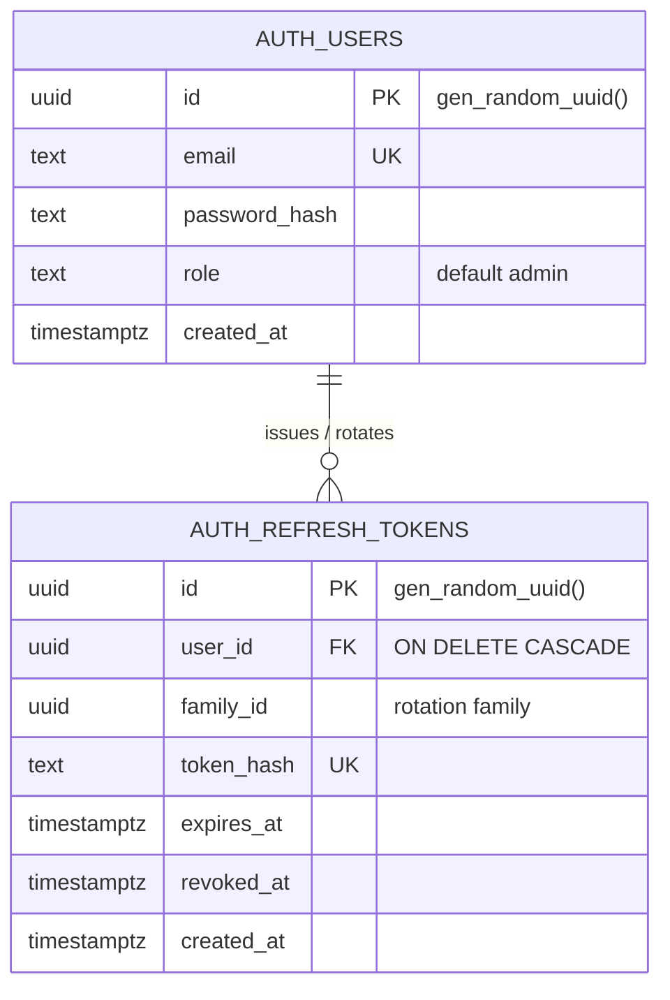
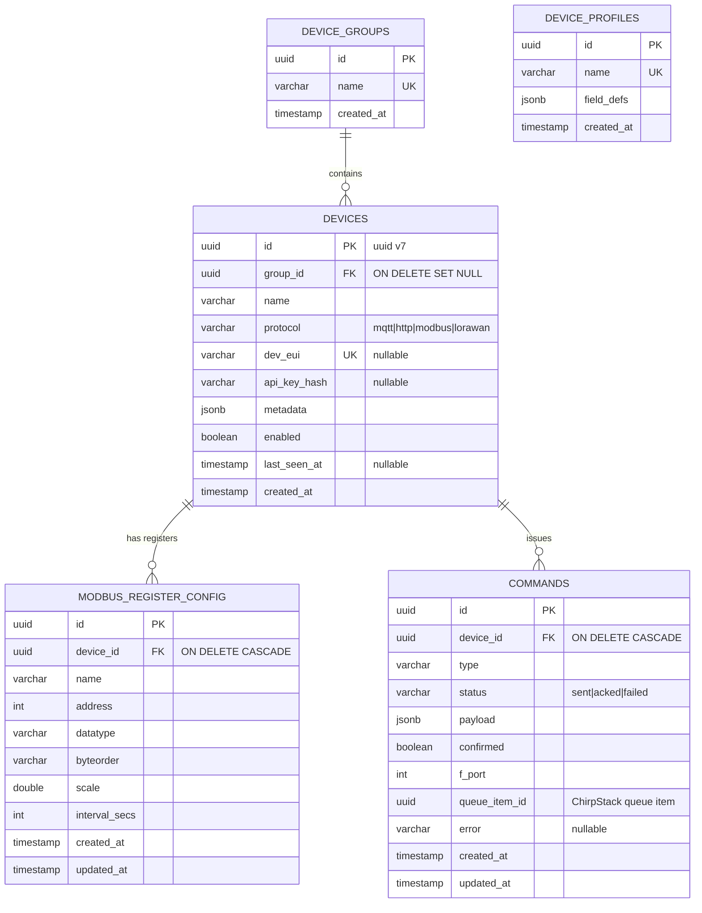
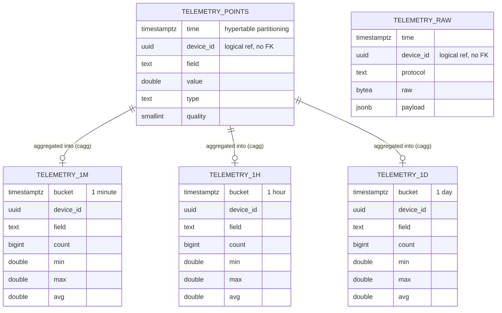
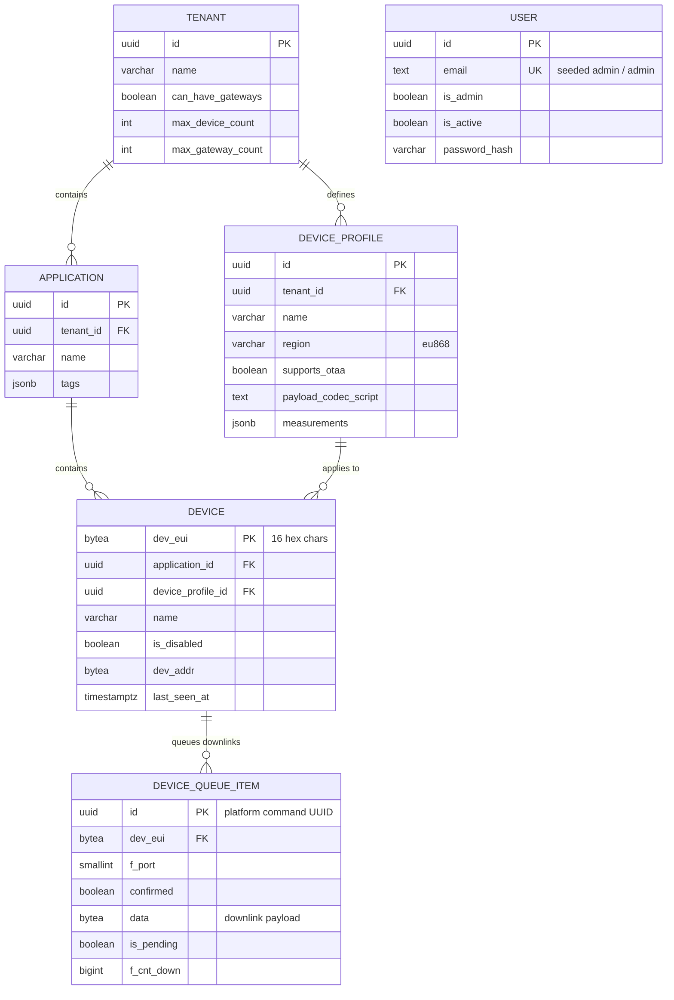
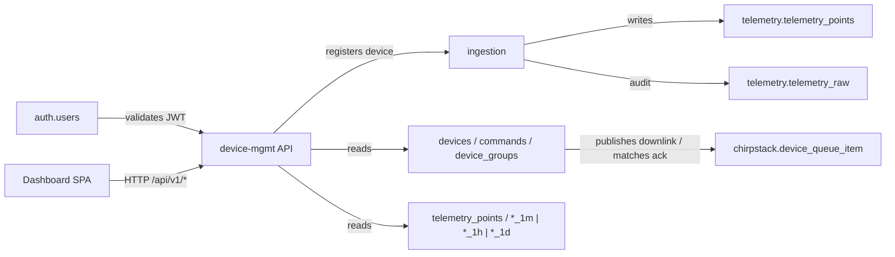

# Database ERD

Entity-relationship diagrams for every table owned by the platform services
(**auth**, **device management**, **ingestion**) in the shared `iiot` database.

Excluded by design:

- **ChirpStack** — owns the separate `chirpstack` database (LoRaWAN NS/AS
  schema, auto-migrated by the ChirpStack container). Included below as a
  cross-reference because the platform stores logical references to it
  (`commands.queue_item_id` → `device_queue_item`, `devices.dev_eui` →
  `device.dev_eui`).
- **Mosquitto** — broker state lives in files (`/mosquitto/data`,
  `mosquitto.passwd`), not in PostgreSQL. See the note below.

## Database layout

All services share one PostgreSQL 16 + TimescaleDB instance, using distinct
schemas inside the `iiot` database:

| Service       | Schema      | Tables / views                                                                                                           | Owner role      |
|---------------|-------------|--------------------------------------------------------------------------------------------------------------------------|-----------------|
| Auth          | `auth`      | `users`, `refresh_tokens`                                                                                                | `iiot`          |
| Device mgmt   | `public`    | `device_groups`, `device_profiles`, `devices`, `modbus_register_config`, `commands`                                      | `iiot`          |
| Ingestion     | `telemetry` | `telemetry_raw`, `telemetry_points` (hypertable), `telemetry_1m`, `telemetry_1h`, `telemetry_1d` (continuous aggregates) | `iiot`          |
| Dashboard     | —           | none — Vue SPA, reads the device-mgmt API over HTTP                                                                      | —               |

`telemetry.*` `device_id` columns are **logical** references to `devices.id`
(no database-level FK: ingestion writes decoupled from the device registry for
burst throughput). Same for `commands.queue_item_id` → ChirpStack's queue item.

---

## Auth

### `auth.users`

| Column        | Type          | Key | Notes                          |
|---------------|---------------|-----|--------------------------------|
| `id`          | `UUID`        | PK  | default `gen_random_uuid()`    |
| `email`       | `TEXT`        | UK  | login identifier               |
| `password_hash` | `TEXT`      |     | never stores plaintext         |
| `role`        | `TEXT`        |     | default `'admin'`              |
| `created_at`  | `TIMESTAMPTZ` |     | default `now()`                |

### `auth.refresh_tokens`

| Column       | Type          | Key | Notes                                      |
|--------------|---------------|-----|--------------------------------------------|
| `id`         | `UUID`        | PK  | default `gen_random_uuid()`                |
| `user_id`    | `UUID`        | FK  | → `auth.users.id` `ON DELETE CASCADE`      |
| `family_id`  | `UUID`        |     | rotation family; indexed                   |
| `token_hash` | `TEXT`        | UK  | opaque refresh token, stored hashed        |
| `expires_at` | `TIMESTAMPTZ` |     |                                            |
| `revoked_at` | `TIMESTAMPTZ` |     | nullable; set on rotation/revoke           |
| `created_at` | `TIMESTAMPTZ` |     | default `now()`                            |

---

## Device management (`public` schema)

### `device_groups`

| Column       | Type          | Key | Notes                        |
|--------------|---------------|-----|------------------------------|
| `id`         | `UUID`        | PK  | default `gen_random_uuid()`  |
| `name`       | `VARCHAR(255)`| UK  | unique group name            |
| `created_at` | `TIMESTAMP`   |     |                              |

### `device_profiles`

| Column       | Type          | Key | Notes                                     |
|--------------|---------------|-----|-------------------------------------------|
| `id`         | `UUID`        | PK  | default `gen_random_uuid()`               |
| `name`       | `VARCHAR(255)`| UK  |                                           |
| `field_defs` | `JSONB`       |     | field definitions per protocol            |
| `created_at` | `TIMESTAMP`   |     |                                           |

Standalone — currently no FK from `devices`; per-device profile metadata is
kept in `devices.metadata` JSONB.

### `devices`

| Column         | Type          | Key | Notes                                               |
|----------------|---------------|-----|-----------------------------------------------------|
| `id`           | `UUID`        | PK  | Uuid v7                                             |
| `group_id`     | `UUID`        | FK  | → `device_groups.id` `ON DELETE SET NULL`, nullable |
| `name`         | `VARCHAR(255)`|     |                                                     |
| `protocol`     | `VARCHAR(16)` |     | `mqtt` \| `http` \| `modbus` \| `lorawan`           |
| `dev_eui`      | `VARCHAR(16)` | UK  | nullable, LoRaWAN EUI (hex)                         |
| `api_key_hash` | `VARCHAR(64)` |     | nullable; API-key auth for mqtt/http devices        |
| `metadata`     | `JSONB`       |     |                                                     |
| `enabled`      | `BOOLEAN`     |     |                                                     |
| `last_seen_at` | `TIMESTAMP`   |     | nullable                                            |
| `created_at`   | `TIMESTAMP`   |     |                                                     |

### `modbus_register_config`

| Column         | Type           | Key | Notes                                      |
|----------------|----------------|-----|--------------------------------------------|
| `id`           | `UUID`         | PK  |                                            |
| `device_id`    | `UUID`         | FK  | → `devices.id` `ON DELETE CASCADE`         |
| `name`         | `VARCHAR(255)` |     | register logical name; UK with `device_id` |
| `address`      | `INT`          |     | Modbus register address                    |
| `datatype`     | `VARCHAR(16)`  |     | e.g. `int16`, `float32`                    |
| `byteorder`    | `VARCHAR(16)`  |     | e.g. `big-endian`, `little-endian`         |
| `scale`        | `DOUBLE PRECISION` | | multiplier applied to raw value            |
| `interval_secs`| `INT`          |     | poll interval                              |
| `created_at`   | `TIMESTAMP`    |     |                                            |
| `updated_at`   | `TIMESTAMP`    |     |                                            |

Unique index: `(device_id, name)`.

### `commands`

| Column         | Type           | Key | Notes                                           |
|----------------|----------------|-----|-------------------------------------------------|
| `id`           | `UUID`         | PK  |                                                 |
| `device_id`    | `UUID`         | FK  | → `devices.id` `ON DELETE CASCADE`              |
| `type`         | `VARCHAR(32)`  |     | command type                                    |
| `status`       | `VARCHAR(16)`  |     | `sent` \| `acked` \| `failed` (lifecycle)       |
| `payload`      | `JSONB`        |     | command payload                                 |
| `confirmed`    | `BOOLEAN`      |     | LoRaWAN confirmed downlink                      |
| `f_port`       | `INT`          |     | LoRaWAN FPort                                   |
| `queue_item_id`| `UUID`         |     | logical ref to ChirpStack queue item (nullable) |
| `error`        | `VARCHAR(512)` |     | nullable; failure reason                        |
| `created_at`   | `TIMESTAMP`    |     |                                                 |
| `updated_at`   | `TIMESTAMP`    |     |                                                 |

---

## Ingestion (`telemetry` schema)

### `telemetry.telemetry_raw` — raw payload audit/replay store

| Column      | Type          | Key | Notes                                     |
|-------------|---------------|-----|-------------------------------------------|
| `time`      | `TIMESTAMPTZ` |     | sample time                               |
| `device_id` | `UUID`        |     | logical → `devices.id` (no FK)            |
| `protocol`  | `TEXT`        |     | `mqtt` \| `http` \| `modbus` \| `lorawan` |
| `raw`       | `BYTEA`       |     | nullable; original payload (FRMPayload)   |
| `payload`   | `JSONB`       |     | normalized envelope                       |

Index: `(device_id, time DESC)`.

### `telemetry.telemetry_points` — canonical time-series (hypertable)

| Column      | Type               | Key | Notes                            |
|-------------|--------------------|-----|----------------------------------|
| `time`      | `TIMESTAMPTZ`      |     | partitioning column (hypertable) |
| `device_id` | `UUID`             |     | logical → `devices.id` (no FK)   |
| `field`     | `TEXT`             |     | normalized field name            |
| `value`     | `DOUBLE PRECISION` |     |                                  |
| `type`      | `TEXT`             |     | e.g. `float`, `int`, `bool`      |
| `quality`   | `SMALLINT`         |     | default `0`                      |

Indexes: `(device_id, time DESC)`, `(field, time DESC)`. No primary key —
insertion is append-only via `COPY` batches.

### Continuous aggregates (materialized views)

`telemetry.telemetry_1m`, `telemetry.telemetry_1h`, `telemetry.telemetry_1d` —
one row per `(bucket, device_id, field)`:

| Column                | Type               | Notes                                                |
|-----------------------|--------------------|------------------------------------------------------|
| `bucket`              | `TIMESTAMPTZ`      | `time_bucket('1 minute'|'1 hour'|'1 day', time)`     |
| `device_id`           | `UUID`             |                                                      |
| `field`               | `TEXT`             |                                                      |
| `count`               | `BIGINT`           | `COUNT(*)`                                           |
| `min` / `max` / `avg` | `DOUBLE PRECISION` |                                                      |

Refresh policies: 30-day window; 1m refreshed every 5 min, 1h every 30 min,
1d every 6 hours.

---

## ChirpStack (cross-reference)

ChirpStack v4 owns a **separate** `chirpstack` database in the same PostgreSQL
16 instance. Its schema is auto-migrated by the ChirpStack container on first
boot — this section only documents the tables the platform cross-references,
so the two ERDs can be read together. The full schema is managed by
ChirpStack's own migrations (`__diesel_schema_migrations`).

Relationships among the key tables (`pg_constraint`-verified on the deployed
Pi):

| Child              | Parent            | Constraint                       |
|--------------------|-------------------|----------------------------------|
| `application`      | `tenant`          | `application_tenant_id_fkey`     |
| `device_profile`   | `tenant`          | `device_profile_tenant_id_fkey`  |
| `device`           | `application`     | `device_application_id_fkey`     |
| `device`           | `device_profile`  | `device_device_profile_id_fkey`  |
| `device_queue_item`| `device`          | `device_queue_item_dev_eui_fkey` |

### Cross-references to the platform schemas

| Platform column                 | ChirpStack column         | Meaning                                                                              |
|---------------------------------|---------------------------|--------------------------------------------------------------------------------------|
| `public.devices.dev_eui`        | `device.dev_eui`          | Same logical EUI: platform stores it as 16-char hex (`VARCHAR(16)`), ChirpStack as `BYTEA`. Set by the claim endpoint; ingestion resolves LoRaWAN uplinks via this EUI. |
| `public.commands.queue_item_id` | `device_queue_item.id`    | The platform command UUID **is** the ChirpStack queue-item id — device-mgmt publishes the downlink to the ChirpStack MQTT integration with `id = <command uuid>` and later matches `event/ack` / `event/txack` by that id. |

There is no database-level FK between the two schemas (they are separate
databases); the links are enforced by application logic in device-mgmt and
ingestion.

---

## Mosquitto (no ERD)

Mosquitto keeps **no state in PostgreSQL**, so there is nothing to diagram.
Its state lives in two places on disk:

- `/mosquitto/data/` — the persistence store (retained messages, session
  state), backed by the `mqtt_data` volume (`persistence true` in
  `deploy/mqtt/mosquitto.conf`).
- `/mosquitto/creds/mosquitto.passwd` — the password file. It holds the four
  service accounts (`broker`, `chirpstack`, `ingestion`, `device-mgmt`) plus
  one entry **per MQTT device** (username = device id, password = the device's
  single-return API key), provisioned by device-mgmt via `mosquitto_passwd`.

Access control is enforced by the ACL file (`deploy/mqtt/acl`), not by any
database. See `iiot-platform-mqtt.md` for the topic and ACL details.

---

## Dashboard

No tables. The Vue 3 SPA is stateless on the client: it calls the
device-mgmt REST API (`/api/v1/*`) and subscribes to the Mercure SSE hub. Any
persistence it displays is owned by the device-mgmt and ingestion schemas above.

## Cross-service flow (how the tables relate across services)

