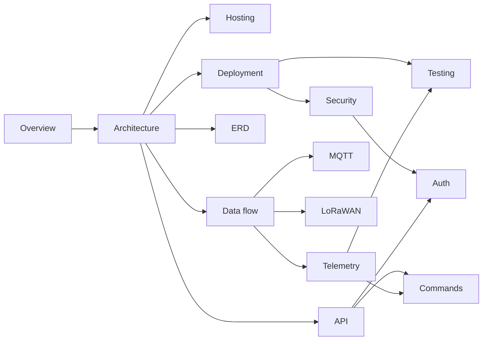

# IIoT Platform — Glossary

Terms used across the platform documentation. Protocol-specific flows are
cross-linked to the relevant document.

## Concepts

| Term | Meaning |
|------|---------|
| **Device** | A registered piece of field equipment. Has a protocol (`mqtt`, `http`, `modbus`, `lorawan`), a stable UUID, metadata and (for `mqtt`/`http`) an API key. See [API](iiot-platform-api.md). |
| **Uplink / downlink** | Uplink = data from a device to the platform; downlink = a command from the platform to a device. |
| **Command** | A downlink request, tracked through `pending → sent → acked \| failed`. See [Commands](iiot-platform-commands.md). |
| **Register** | A named, typed Modbus address mapping (address, datatype, byteorder, scale) that the poller reads on an interval. |
| **Telemetry point** | One `(time, device_id, field, value, type, quality)` row — the atomic unit of stored telemetry. See [Telemetry](iiot-platform-telemetry.md). |
| **Continuous aggregate** | A TimescaleDB materialised view that rolls telemetry into `1m`/`1h`/`1d` buckets automatically. |
| **Hypertable** | A TimescaleDB table partitioned on `time` — `telemetry.telemetry_points`. |
| **Mercure** | The server-sent-events (SSE) hub embedded in Caddy that pushes live updates to the dashboard (`/devices/{id}`). |
| **JWT / JWKS** | JSON Web Token / JSON Web Key Set. Access tokens are EdDSA-signed; device-mgmt validates them against the auth service's public JWKS. See [Auth](iiot-platform-auth.md). |

## Protocols and systems

| Term | Meaning |
|------|---------|
| **MQTT** | Publish/subscribe message bus (Mosquitto) used by every MQTT device and as the internal integration bus for ChirpStack and Modbus. See [MQTT](iiot-platform-mqtt.md). |
| **Mosquitto** | The MQTT broker. No public port; every client authenticated and ACL-scoped. |
| **Modbus TCP** | Field protocol for industrial registers (FC03 read). Polled by the ingestion service, not pushed. |
| **LoRaWAN** | Long-range, low-power radio protocol. Network server = ChirpStack; gateways connect over Semtech UDP (1700). See [LoRaWAN](iiot-platform-lorawan.md). |
| **ChirpStack** | The LoRaWAN network server (NS) + application server (AS) that manages joins, crypto and scheduling. |
| **Gateway bridge** | `chirpstack-gateway-bridge`: translates Semtech UDP packets to/from MQTT (`eu868/gateway/...`). |
| **FRMPayload** | The encrypted application payload bytes inside a LoRaWAN frame, preserved in `telemetry_raw` for audit. |
| **OTAA** | Over-The-Air Activation — the join handshake LoRaWAN devices use to derive session keys (what `lorasim.py` simulates). |
| **DevEUI** | 64-bit LoRaWAN device identifier, written as 16 hex characters. |
| **FPort** | LoRaWAN application port selector (default 10 for downlinks here). |

## Platform services

| Term | Meaning |
|------|---------|
| **auth** | Node service: login, refresh, JWT signing, JWKS, Mercure subscriber tokens, admin seeding. |
| **device-mgmt** | Symfony service: the `/api/v1` REST API — devices, groups, registers, commands, telemetry, insights. |
| **ingestion** | Python service: normalises uplinks from all four protocols and batch-writes them to TimescaleDB. |
| **dashboard** | The browser SPA (login → device list/charts via API + Mercure SSE). |
| **Caddy** | Edge proxy + TLS + Mercure hub. |
| **Consumer** | `device-mgmt-consumer` / `-acks`: long-lived Symfony workers that match ack events back to commands. |

## Relationships between the documents

