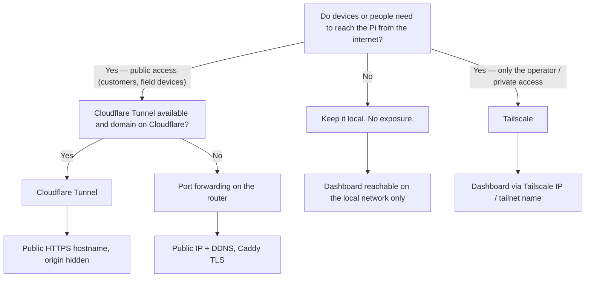

# IIoT Platform — Hosting and Server Requirements

This document tells you what hardware and operating system you need to run
the platform, whether in the cloud (VPS) or on an industrial Raspberry Pi at
the edge, and — only if it is actually required — how to expose the edge
device to the internet.

The operational steps (firewall rules, DNS, upgrades, backup) live in the
[runbook](../deploy/runbook.md). This document is about choosing and preparing
the machine.

## One host or two?

The platform runs as a single Compose stack on one host. There are two
typical placements:

- **Cloud VPS** — everything in one VM in a data centre. Good when the devices
  reach it over the internet (MQTT, HTTP, LoRaWAN gateways can all push to it).
- **Industrial RPi / local server at the edge** — everything on one device in
  the plant or on site. Good when the network is local/air-gapped, when
  latency to machines matters, or when the customer wants the data on-premise.

You can also run one stack in each place (an edge stack and a cloud stack) and
treat them as separate deployments; the documentation applies to each host.

## Minimum requirements — cloud VPS

| Resource  | Minimum                | Recommended             |
|-----------|------------------------|-------------------------|
| CPU       | 2 vCPU                 | 4 vCPU                  |
| RAM       | 4 GB                   | 8 GB                    |
| Disk      | 40 GB SSD              | 80 GB SSD (grows with telemetry) |
| OS        | Ubuntu 22.04+ (64-bit) | Ubuntu 24.04 LTS        |
| Runtime   | Docker Engine ≥ 24 + Compose v2 | same, kept current |
| Network   | Static public IPv4     | IPv4 + IPv6             |

Why these numbers: the stack runs fifteen containers including TimescaleDB
(which is memory-hungry during continuous-aggregate refreshes), ChirpStack,
Redis, Mosquitto, Node, PHP and Python. 4 GB is workable for a small number of
devices; 8 GB leaves headroom for the database and bursty ingestion.

**Firewall (only these inbound ports):**

| Port      | Purpose                |
|-----------|------------------------|
| `22/tcp`  | SSH (admin)            |
| `80/tcp`  | HTTP (Caddy)           |
| `443/tcp` | HTTPS (Caddy)          |
| `1700/udp`| LoRaWAN gateways       |

Everything else stays closed. In particular **never** expose Mosquitto
(1883), PostgreSQL (5432), Redis, or the ChirpStack API (8080/8090) to the
public internet. In the compose file, remove the `ports:` entries for `db`,
`mqtt`, `chirpstack` and `chirpstack-rest-api` on a VPS (see the runbook's
production note). The `8080/8090` ports are only needed for local ChirpStack
admin work and should be restricted to your admin IP or removed.

## Minimum requirements — industrial RPi / edge device

The platform is validated on a Raspberry Pi 4 (the parity host for the
acceptance run). All container images publish `arm64` builds, so any 64-bit
ARM device works.

| Resource  | Minimum                | Recommended             |
|-----------|------------------------|-------------------------|
| Device    | Raspberry Pi 4 (4 GB)  | Raspberry Pi 4 (8 GB) or Pi 5 |
| RAM       | 4 GB                   | 8 GB                    |
| Storage   | 32 GB SD card          | Industrial microSD or **USB SSD** |
| OS        | Raspberry Pi OS Lite 64-bit or Ubuntu Server 64-bit | same |
| Runtime   | Docker Engine ≥ 24 + Compose v2 | same |
| Power     | Official 5 V/3 A supply (or UPS) | UPS for clean shutdowns |

Edge considerations:

- **Storage**: SD cards wear out under heavy database writes. A quality
  industrial microSD, or better a USB SSD, extends the life of the install
  significantly. Reserve disk for TimescaleDB growth.
- **Power**: an underpowered supply causes random restarts and database
  corruption. Use the official supply; add a UPS if mains power is unreliable.
- **64-bit OS is mandatory** — the image set (including TimescaleDB and
  ChirpStack) has no 32-bit ARM builds.
- **Keep it internal by default**: on the edge, Mosquitto, PostgreSQL, Redis
  and the ChirpStack API must **not** be published to the host. Only Caddy
  (80/443) and, if you run LoRaWAN, UDP 1700 need to be reachable.
- If the dashboard is only used by you or the site operator, you usually do
  **not** need any internet exposure at all — see the next section.

## Exposing the edge Pi to the internet (only if required)

Before exposing anything, answer the question: **who actually needs to reach
it, and from where?**

- Only the operator, from a laptop/phone, over a private network → you almost
  certainly only need **Tailscale** (private, no public exposure).
- A customer or remote office needs it over the public internet, or a device
  in the field must push data to it → a public path is required (Cloudflare
  Tunnel, or port forwarding if you cannot use either).

### Option A — Tailscale (recommended for operator/private access)

Tailscale is a WireGuard-based mesh VPN. It gives the Pi a private address in
your tailnet and lets you reach the dashboard securely from any of your
devices — without opening a single port on the router, and with encryption in
transit.

Steps:

1. Install on the Pi:
   `curl -fsSL https://tailscale.com/install.sh | sh`
2. Start it: `tailscale up` — follow the printed link to authorise the device.
3. From now on the Pi is reachable at its tailnet address, e.g.
   `http://raspberrypi` (MagicDNS) or `http://100.x.y.z`, on the local network
   **and** anywhere in the world, as long as the device you use is on the same
   tailnet (install the Tailscale app on your laptop/phone and log in with the
   same account).

To serve HTTPS on the tailnet, enable Tailscale HTTPS for the Pi and set
`DOMAIN`/`SERVER_NAME` in `deploy/.env` to the machine's `.ts.net` name so
Caddy binds that name.

Why this is the default recommendation: no open ports, no public scan
surface, works behind NAT/CGNAT, granular device ACLs, and it disappears from
the public internet entirely.

### Option B — Cloudflare Tunnel (recommended for public access)

A Cloudflare Tunnel gives the Pi a **public HTTPS hostname** without opening
any inbound ports. Outbound connections are made by `cloudflared` to
Cloudflare's edge; visitors reach the hostname over Cloudflare's network and
the origin IP is hidden.

Prerequisites: a domain you can manage in Cloudflare (free plan is enough).

Steps:

1. On the Pi, install and authenticate `cloudflared`:
   `curl -L https://github.com/cloudflare/cloudflared/releases/latest/download/cloudflared-linux-arm64 -o /usr/local/bin/cloudflared`
   (x86_64 VPS users use `cloudflared-linux-amd64`).
2. `cloudflared tunnel login` — follow the browser link, pick your domain.
3. Create a tunnel: `cloudflared tunnel create iiot` — note the tunnel token.
4. Route hostnames to the tunnel:
   `cloudflared tunnel route dns iiot iot.example.com`
   `cloudflared tunnel route dns iiot chirpstack.example.com`
5. Run the tunnel as a systemd service or a container, pointing the routes at
   Caddy over plain HTTP on localhost:
   - `iot.example.com` → `http://localhost:80`
   - `chirpstack.example.com` → `http://localhost:8080`
6. Set `DOMAIN=iot.example.com` and `CHIRPSTACK_SITE_ADDR=http://chirpstack.example.com`
   in `deploy/.env` so Caddy serves the right hostnames (Cloudflare terminates
   TLS, so Caddy keeps its own self-signed/local setup).

Caveats:

- You must create one route per hostname Caddy serves (`iot.example.com` and
  `chirpstack.example.com` in the default setup).
- Telemetry flows through Cloudflare's edge — fine for normal volumes, but a
  high-throughput edge installation should instead publish uplinks over the
  local network (MQTT/Modbus) and keep the public surface to the dashboard.

### Option C — Port forwarding (last resort)

Only if you cannot use Tailscale or Cloudflare (no account options, or a
restricted network). You expose the Pi's ports on the router.

Steps:

1. Give the Pi a fixed LAN address (static DHCP reservation or a fixed
   address in `/etc/dhcpcd.conf`).
2. On the router, forward inbound `80/tcp` and `443/tcp` to the Pi. Forward
   `1700/udp` too only if LoRaWAN gateways must reach it from the internet.
3. If your public IP changes, set up DDNS on the router (e.g. DuckDNS) and
   point a real domain at it so Caddy can obtain trusted Let's Encrypt
   certificates (`DOMAIN` in `deploy/.env`).
4. Open `22/tcp` only to a trusted source IP range if possible; otherwise rely
   on strong keys, disable password auth and consider fail2ban.

Risks and mitigations:

- The Pi is now a real internet-facing server: keep the OS patched, keep
  Docker current, and never expose 1883/5432/8080/8090.
- The MQTT broker and the database must stay on the internal network (they are
  by default in the compose file — do not add `ports:` for them).
- Port forwarding works through one NAT only and can be flaky on CGNAT
  (mobile/Starlink-style connections); Tailscale or Cloudflare are the more
  robust options there.

## Deciding table

| Situation                                        | Recommended |
|--------------------------------------------------|-------------|
| Operator-only access, private tailnet            | Tailscale   |
| Public dashboard / customer access               | Cloudflare Tunnel |
| Field devices must push data over the internet   | Cloudflare Tunnel (or a cloud VPS instead) |
| No Tailscale/Cloudflare possible                 | Port forwarding with strong SSH hygiene |
| Large telemetry volumes from local machines      | Stay fully local; no exposure at all |
