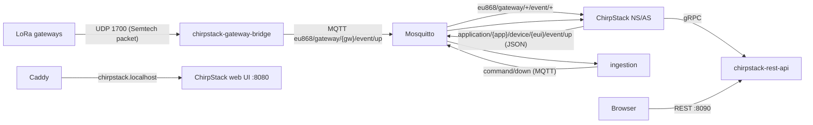

# IIoT Platform — LoRaWAN Integration

This document covers the LoRaWAN side of the platform: the components between
the radio and the platform services, and how uplinks and downlinks travel
through them. The generic flows are in [Data flow](iiot-platform-data-flow.md).

## Components



| Component | Image | Role |
|-----------|-------|------|
| `chirpstack-gateway-bridge` | `chirpstack/chirpstack-gateway-bridge:4` | Listens for Semtech UDP packets on **1700/udp** and republishes them as MQTT on `eu868/gateway/{gateway_id}/event/{type}`; gateway commands come back the same way. |
| `chirpstack` | `chirpstack/chirpstack:4.18.0` | The LoRaWAN network server (NS) and application server (AS). Handles joins, crypto (MIC, AES), ADR and scheduling; runs the MQTT integration that emits application events. |
| `chirpstack-rest-api` | `chirpstack/chirpstack-rest-api:4` | gRPC → REST facade (`--server chirpstack:8080 --bind 0.0.0.0:8090`). Used for admin/configuration over HTTP. |
| `chirpstack.localhost` | — | Caddy site that proxies the ChirpStack web UI (which hard-codes `/` and cannot run under a sub-path). |

## Configuration summary

From `deploy/chirpstack/chirpstack.toml` and `region_eu868.toml`:

- **Region**: `eu868` (868 MHz, 10 channels — 9 LoRa 125/250 kHz + 1 FSK),
  RX2 `869.525 MHz`, ADR enabled.
- **Database**: the separate `chirpstack` database on the shared TimescaleDB
  instance (`postgres://$CHIRPSTACK_DB_USER:...@db:5432/chirpstack`). Owned by
  the `chirpstack` role (see [Security](iiot-platform-security.md)).
- **Redis**: `redis://redis:6379/0` with prefix `chirpstack:`.
- **API**: gRPC-web on `0.0.0.0:8080` (web UI + REST facade), monitoring on
  `0.0.0.0:8081`, secured by `CHIRPSTACK_API_SECRET`.
- **Integration**: MQTT only. Event topic
  `application/{{application_id}}/device/{{dev_eui}}/event/{{event}}`, command
  topic `application/{{application_id}}/device/{{dev_eui}}/command/{{command}}`,
  JSON payloads, `clean_session = false` (so events survive broker restarts).
- **Broker access**: the `chirpstack` MQTT service account may read/write
  `eu868/#` (gateway frames) and `application/#` (AS events).

## How the platform talks to ChirpStack

The platform integrates **over MQTT only** — `device-mgmt` makes no REST calls
to the ChirpStack API.

**Uplinks** — ChirpStack re-publishes every device uplink as
`application/{app_id}/device/{dev_eui}/event/up`. `ingestion` subscribes to
that pattern, extracts the `dev_eui` from the topic, resolves it to a platform
device id (`SELECT id FROM devices WHERE LOWER(dev_eui) = LOWER($1)`), decodes
the payload-codec `object`, and stores the FRMPayload raw bytes for audit.

**Downlinks** — `device-mgmt` publishes to
`application/{app_id}/device/{dev_eui}/command/down`. ChirpStack queues it
(storing the command UUID as the queue-item id) and eventually transmits it
via the gateway. Acknowledgements come back as `event/txack` (gateway
accepted the frame) and `event/ack` (device acknowledged), consumed by the
`device-mgmt-consumer`. See [Commands](iiot-platform-commands.md).

**Claiming devices** — a LoRaWAN device is registered in `device-mgmt` first,
then bound to the network via `POST /api/v1/devices/{id}/claim` with its
16-hex-char `dev_eui`. Unclaimed EUIs appearing in uplink events are
quarantined by ingestion.

## Admin access

- **First login**: the initial ChirpStack migration seeds an admin user with
  email `admin` and password `admin`. Change it immediately.
- **Change the password**:
  ```
  docker compose exec chirpstack chirpstack set-password --email admin
  ```
- The web UI is reached on the ChirpStack hostname (default
  `http://chirpstack.localhost` — needs a hosts/DNS entry, or set
  `CHIRPSTACK_SITE_ADDR`). The UI uses gRPC-web against ChirpStack; plain
  `/api/...` HTTP probes against ChirpStack return 404.

## Testing without hardware

`deploy/chirpstack/scripts/lorasim.py` is a minimal LoRaWAN 1.0.4 OTAA device
+ gateway simulator: it publishes gateway frames on `eu868/gateway/<gw>/event/up`,
performs a real JoinRequest/JoinAccept handshake, derives the session keys,
encrypts FRMPayloads and publishes uplinks — exercising the exact same path a
real gateway would. The e2e suite uses it to validate the LoRaWAN scenario.
