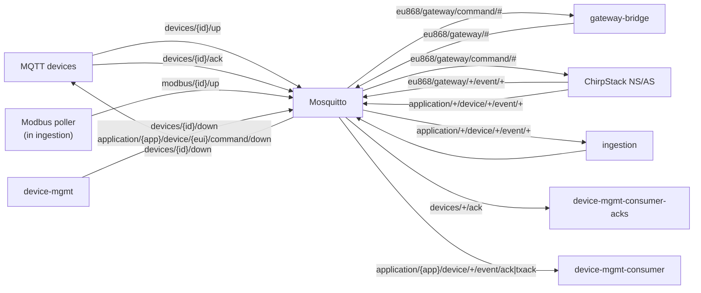

# IIoT Platform — MQTT Integration

This document covers the Mosquitto broker: its configuration, access control,
topic conventions and how credentials are provisioned. The flows that use
these topics are in [Data flow](iiot-platform-data-flow.md).

## Broker topology

Key facts:

- The broker listens on **1883 internally only** — there is no host-published
  port, and the `backend` network it lives on is `internal: true`.
- Anonymous access is disabled (`allow_anonymous false`); every client must
  authenticate with a username/password.
- ACLs are enforced per user/pattern; **the first matching rule wins**.

## Service accounts

Seeded by `deploy/mqtt/entrypoint.sh` on first boot (`mosquitto_passwd`),
values from `deploy/.env`:

| Username | ACL (topics) | Used by |
|----------|--------------|---------|
| `broker` (admin) | readwrite `#` | operator/health checks |
| `chirpstack` | readwrite `eu868/#`, `application/#` | ChirpStack NS and gateway-bridge |
| `ingestion` | readwrite `ingest/#`, `devices/#`, `modbus/#`, `application/#` | ingestion service |
| `device-mgmt` | readwrite `application/#`, `devices/#` | device-mgmt publishers and consumers |

Every **MQTT device** is added as its own user: username = device id,
password = the device's API key, confined by the pattern rule
`readwrite devices/%u/#` (`%u` is substituted with the username). A device can
therefore only ever read and write its own topic subtree.

## Topic conventions

| Topic | Direction | Payload | Notes |
|-------|-----------|---------|-------|
| `devices/{id}/up` | device → ingestion | JSON object of fields | MQTT device uplink (QoS 0 subscription) |
| `devices/{id}/down` | device-mgmt → device | `{"id": "<command uuid>", "payload": {...}}` | MQTT command downlink |
| `devices/{id}/ack` | device → device-mgmt | `{"id": "<command uuid>"}` | Device acknowledges a command; `id` is echoed verbatim |
| `modbus/{id}/up` | ingestion poller → ingestion | `{"time": "...", "<register>": <value>, ...}` | Modbus poller samples (looped back through the broker) |
| `application/{app}/device/{eui}/event/up` | ChirpStack → ingestion | ChirpStack uplink JSON | LoRaWAN uplink events |
| `application/{app}/device/{eui}/event/ack` | ChirpStack → device-mgmt | `{"queueItemId", "acknowledged", ...}` | LoRaWAN radio acknowledgement |
| `application/{app}/device/{eui}/event/txack` | ChirpStack → device-mgmt | same shape | Gateway accepted the frame for transmission |
| `application/{app}/device/{eui}/command/down` | device-mgmt → ChirpStack | `{"id", "devEui", "confirmed", "fPort", "data"\|"object"}` | LoRaWAN downlink command |
| `eu868/gateway/{gw}/event/{type}` | gateway-bridge → ChirpStack | Semtech frame JSON | Gateway uplink/status events |
| `eu868/gateway/{gw}/command/{type}` | ChirpStack → gateway-bridge | Semtech command JSON | Gateway downlink commands |
| `health` | broker admin | `ok` | Used by the broker's own health check |

All application integration topics use the `chirpstack` service account (or
`ingestion`/`device-mgmt` where noted); QoS is 0 for ingestion subscriptions
and php-mqtt publishes.

## Credential provisioning (devices)

When a non-LoRaWAN device is created or claimed, device-mgmt:

1. generates the API key (`dk_` + 32 random bytes);
2. stores only its SHA-256 hash in `devices.api_key_hash`;
3. runs `mosquitto_passwd -b <passwd_file> <device_id> <api_key>` to add a
   broker account, then fixes the file permissions (group `mqtt`, `0640`).

The broker's entrypoint watches the credential file with `inotify` and sends
Mosquitto a `SIGHUP` the moment the file changes, so newly provisioned devices
can connect without a restart. Deleting a device runs `mosquitto_passwd -D` to
revoke its account.

The password file lives in `deploy/mqtt/data/` (volume `mqtt_data`/bind mount
shared between the broker and device-mgmt).

## Reliability notes

- The broker persists retained messages and session state under
  `/mosquitto/data/`.
- `chirpstack` connects with `clean_session = false`, so ChirpStack events are
  not lost across brief broker restarts.
- Ingestion reconnects with a 1 s retry loop; buffered QoS 0 messages are lost
  during a broker outage by design (devices retry at their own cadence).
