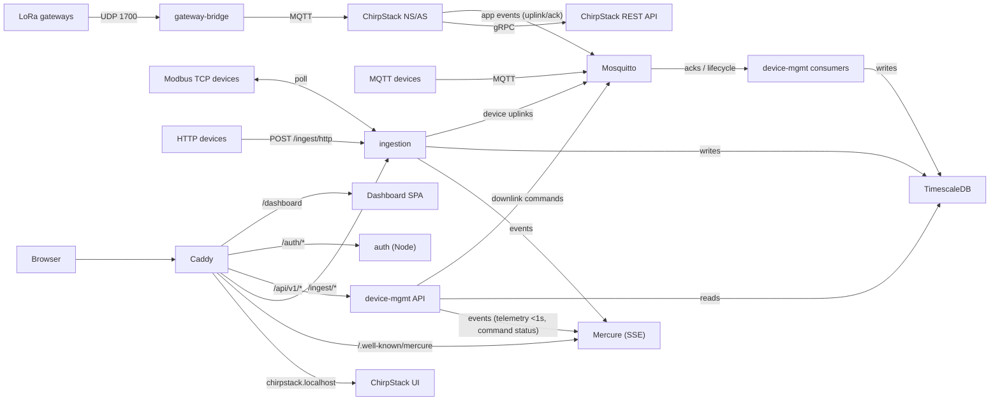

# IIoT Platform — System Overview

This document is part of the platform documentation set. See
[`specs/README.md`](README.md) for the full list and reading order.

## What the platform is

The platform is an open, containerised Industrial Internet of Things (IIoT)
system. It collects time-series telemetry from industrial devices, stores it
in a time-series database, and presents it on a live web dashboard.

It accepts data from four device protocols:

- **MQTT** — devices publish JSON samples to a broker.
- **HTTP** — devices `POST` JSON samples to an ingestion endpoint.
- **Modbus TCP** — the platform polls holding registers on PLCs and
  industrial controllers.
- **LoRaWAN** — sensors join a LoRaWAN network and send frames via a gateway.

Data flows in, is normalised into a single shape, and is stored immediately.
New readings appear on the dashboard in under a second through a real-time
push (SSE via Mercure), without the user refreshing the page.

## The four application services

| Service       | Language / runtime  | Responsibility |
|---------------|---------------------|----------------|
| `auth`        | Node.js (Fastify)   | Identity provider. Issues and signs JWTs (Ed25519), manages logins and refresh-token rotation, mints Mercure subscriber tokens, seeds the admin user. |
| `device-mgmt` | PHP (Symfony, FrankenPHP) | Device registry and REST API. Manages devices, groups and Modbus register configs; routes and tracks downlink commands; verifies JWTs statelessly; provisions MQTT credentials. |
| `ingestion`   | Python (FastAPI)    | Ingests all four protocols, normalises payloads into time-series points, writes them in batches to TimescaleDB and publishes live events. |
| `dashboard`   | Vue 3 SPA (nginx)   | Browser application. Login, device management, live telemetry charts, insights and command control. No database access of its own. |

Two long-running consumers run alongside `device-mgmt` and share its code:

- `device-mgmt-consumer` — consumes ChirpStack downlink ack events
  (`event/ack`, `event/txack`) over MQTT.
- `device-mgmt-consumer-acks` — consumes MQTT device ack messages
  (`devices/+/ack`).

## Supporting infrastructure

| Component | Role |
|-----------|------|
| **TimescaleDB** (PostgreSQL 16) | Two databases: `iiot` (platform schemas: `auth`, `public`, `telemetry`) and `chirpstack`. The telemetry schema uses a hypertable plus `1m`/`1h`/`1d` continuous aggregates. |
| **Mosquitto** | MQTT broker. Internal only — never published to the host. Holds device uplinks, downlinks, acks and the ChirpStack event bus. |
| **Caddy + Mercure** | Single internet-facing entry point (ports 80/443). Reverse-proxies every route and hosts the Mercure SSE hub. |
| **Redis** | Used by ChirpStack for caching/queues. |
| **ChirpStack v4** | LoRaWAN network server + application server. `chirpstack-gateway-bridge` connects real gateways (UDP 1700) to MQTT; `chirpstack-rest-api` exposes a REST facade over its gRPC API. |

## Key features

- **Live telemetry** — readings appear on the dashboard in under a second via
  Mercure SSE, with real-time charts.
- **Time-series storage** — data is stored in a TimescaleDB hypertable with
  automatic downsampling to `1m`/`1h`/`1d` aggregates for insight charts.
- **Command control** — send downlinks to MQTT devices and LoRaWAN devices
  (via the ChirpStack MQTT integration) and track them through
  `pending → sent → acked | failed`.
- **Device management** — register and group devices, claim a LoRaWAN device
  by its EUI, configure Modbus registers, provision per-device MQTT
  credentials and API keys.
- **Secure by default** — Ed25519-signed JWTs verified statelessly, hashed
  device API keys, MQTT password + ACL access, and a Docker network
  (`backend`) that is internal — nothing on it is published to the host.

## How it fits together

## Where to go next

- [Architecture](iiot-platform-architecture.md) — components, networks, ports.
- [Data flow](iiot-platform-data-flow.md) — the five end-to-end flows.
- [API reference](iiot-platform-api.md) — every endpoint.
- [Deployment](iiot-platform-deployment.md) — the compose stack.
- [Hosting](iiot-platform-hosting.md) — minimum server requirements.
