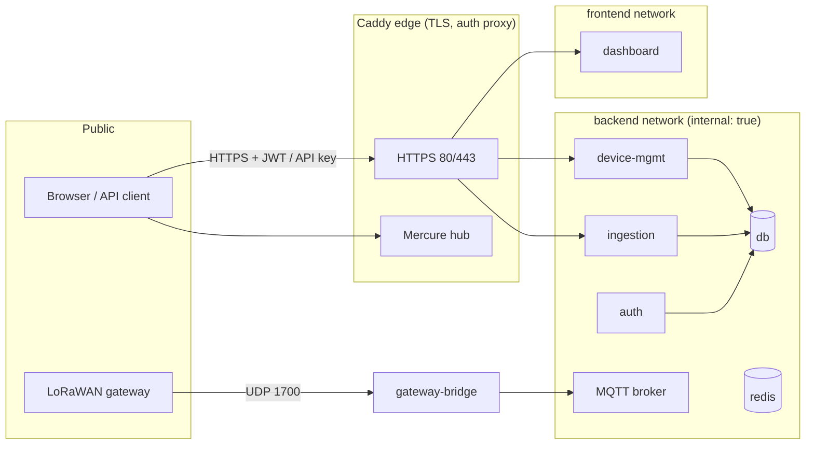

# IIoT Platform — Security Model

This document describes the security boundaries, credentials and known gaps.
Details of the mechanisms are in [Auth](iiot-platform-auth.md),
[MQTT](iiot-platform-mqtt.md) and [Deployment](iiot-platform-deployment.md).

## Trust boundaries

Layers, outside to inside:

1. **Host firewall** — only `22/tcp`, `80/tcp`, `443/tcp` and `1700/udp` are
   open (see [Hosting](iiot-platform-hosting.md)).
2. **Caddy edge** — terminates TLS (automatic Let's Encrypt) and is the only
   path to the dashboard, APIs and SSE hub.
3. **Networks** — the `backend` network is `internal: true`; Docker drops any
   published port on it, so PostgreSQL, Redis, Mosquitto and the ChirpStack
   gRPC/API ports can never escape the stack even if misconfigured.
4. **AuthN/AuthZ** — every internal service authenticates against the broker
   or the auth service; the dashboard only ever sees JWTs.

## Credentials

| Credential | Who | Handling |
|------------|-----|----------|
| `POSTGRES_PASSWORD`, `APP_SECRET`, `MOSQUITTO_PASSWORD` | platform | `deploy/.env` (git-ignored); compose fails fast with `:?` if unset |
| `AUTH_ADMIN_EMAIL` / `AUTH_ADMIN_PASSWORD` | first admin | seeded once (`ON CONFLICT DO NOTHING`), bcrypt (cost 12) at rest |
| Ed25519 signing keypair | auth | generated on first boot, persisted to the `auth_keys` volume; only the public key ever leaves the auth container (JWKS) |
| `MERCURE_PUBLISHER_JWT_KEY` | ingestion, device-mgmt | signs publish-scoped JWTs |
| `MERCURE_SUBSCRIBER_JWT_KEY` | auth → dashboard | signs subscribe-scoped JWTs, one topic per device |
| Device API keys (`dk_` + 32 bytes) | devices | **only the SHA-256 hash is stored**; the raw key is returned exactly once and doubles as the device's MQTT password |
| `CHIRPSTACK_API_SECRET`, `CHIRPSTACK_DB_PASSWORD`, `CHIRPSTACK_MQTT_PASSWORD` | ChirpStack | separate DB role/user/account so a compromise is contained |
| ChirpStack `admin`/`admin` | bootstrap account | **must be changed on first login** |

Relevant properties:

- Access tokens are EdDSA-signed, last 15 minutes and are verified **without
  any state** against the cached JWKS — no database look-up on every request.
- Refresh tokens are opaque, stored hashed, rotated on every use, and one
  reused/expired token revokes its whole family (see
  [Auth](iiot-platform-auth.md#refresh-token-rotation)).
- Mosquitto has `allow_anonymous false`; every device is confined to
  `devices/{id}/#` by username pattern. The credentials file is group-`mqtt`,
  mode `0640`.
- The ChirpStack REST facade connects to ChirpStack with `--insecure` — safe
  only because the gRPC transport never leaves the internal backend network.

## Input validation

- All `/api/v1` routes except `/api/v1/health` require a valid JWT
  (`security.yaml` access control).
- Ingestion rejects payloads over 64 KiB (413) and requires a valid
  `X-API-Key` (401) — see [API](iiot-platform-api.md#ingestion).
- Telemetry normalisation drops non-numeric values rather than trusting raw
  payloads; register definitions validate datatype/byteorder/scale.
- JSON schemas are validated on registration and command creation; unknown
  command ids on the ack topics are ignored.

## Known gaps and recommendations

- **No rate limiting on login** — `POST /auth/login` currently has no
  throttling. Enable Symfony login throttling / an ingress rate limit and
  consider fail2ban for SSH.
- **ChirpStack bootstrap credentials** — v4 seeds `admin`/`admin`; until it is
  changed, anyone reaching `chirpstack.<domain>` can take over the network
  server. Change it during first-login (documented in the runbook).
- **Backups are unencrypted at rest** — the plain-SQL dumps should be
  encrypted (restic/rclone crypt, or GPG) if they hold sensitive telemetry.
- **`5432`/`8080`/`8090` published in dev** — fine on localhost, but must be
  removed or firewalled on a real host (see
  [Deployment](iiot-platform-deployment.md#what-is-exposed)).
- **Telemetry privacy** — device data leaves the platform only via the
  dashboard/API over TLS; no telemetry is sent to third parties.

## Recovery

- Restores stop the writers before loading dumps, so a restore never races
  with live writes (see [Deployment](iiot-platform-deployment.md#backups)).
- Logs are capped per container; container restarts are automatic
  (`restart: unless-stopped`).
