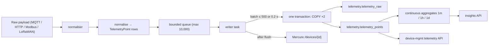

# IIoT Platform — Telemetry Pipeline

This document explains how telemetry moves from a raw payload to stored
time-series data and insight rollups. The database tables are described in
[Database ERD](iiot-platform-erd.md); the flows that feed this pipeline are in
[Data flow](iiot-platform-data-flow.md).

## Pipeline at a glance

## Normalisation

Every payload, whatever its protocol, is converted into a list of
`TelemetryPoint` rows with the same shape:

| Field       | Meaning |
|-------------|---------|
| `time`      | Sample time. From the payload's `time` field if present (ISO-8601, naive assumed UTC), otherwise ingestion time. Missing/invalid → the uplink is rejected. |
| `device_id` | The platform device UUID. From the MQTT topic, the HTTP path, or resolved from `dev_eui` for LoRaWAN. |
| `field`     | The name of the measurement. |
| `value`     | A numeric value. Booleans become 1.0/0.0; integers stay integers; floats stay floats; numeric strings are parsed. |
| `type`      | `bool` \| `int` \| `float`. |
| `quality`   | Quality flag, currently always 0. |

Non-numeric values (nested objects, text) are skipped rather than failing the
whole message. LoRaWAN messages are special-cased: decoded fields come from
the ChirpStack payload-codec output (the `object` envelope key), everything
else from the envelope keys minus the LoRaWAN metadata, and the raw
FRMPayload bytes are preserved for replay.

## Storage

Two tables in the `telemetry` schema of the `iiot` database:

- **`telemetry_points`** — the canonical time-series. A TimescaleDB hypertable
  partitioned on `time`. Indexes on `(device_id, time DESC)` and
  `(field, time DESC)`. It deliberately has **no primary key**: writes are
  append-only batch inserts, and a PK would add uniqueness-check overhead to
  every COPY. This is the table the telemetry API reads.
- **`telemetry_raw`** — the audit/replay store. One row per received sample:
  `time`, `device_id`, `protocol`, `raw` (original payload bytes, LoRaWAN
  FRMPayload), `payload` (the full normalised JSON envelope). Index on
  `(device_id, time DESC)`.

### Write path

The writer collects uplinks from a bounded queue until either 500 are ready or
0.2 s has elapsed, then:

1. opens **one transaction**;
2. `COPY`s the rows into `telemetry_raw` and `telemetry_points` (column lists
   `[time, device_id, protocol, raw, payload]` and
   `[time, device_id, field, value, type, quality]`);
3. commits;
4. publishes one Mercure SSE event per device (`/devices/{id}`) so the
   dashboard updates live.

If the database write fails the whole batch is dropped and logged (no retry);
telemetry is never lost because of a Mercure failure, only because of a
database failure.

## Continuous aggregates

Three materialised views downsample `telemetry_points` automatically:

| View                | Bucket    | Refresh policy |
|---------------------|-----------|----------------|
| `telemetry_1m`      | 1 minute  | every 5 minutes |
| `telemetry_1h`      | 1 hour    | every 30 minutes |
| `telemetry_1d`      | 1 day     | every 6 hours |

Each row is one `(bucket, device_id, field)` with `count`, `min`, `max` and
`avg`. The rollup history is kept for **30 days** (`start_offset` on the
policies). These views back the insights API (`/api/v1/insights/*`), so long
window summaries never scan the raw hypertable.

## How the data is read back

- **Live/last values** — `/api/v1/devices/{id}/last` runs
  `SELECT DISTINCT ON (field) ... ORDER BY field, time DESC`, giving the most
  recent value per field with no window.
- **Series charts** — `/api/v1/devices/{id}/telemetry` bucketed on the fly
  with `time_bucket` over `telemetry_points`, at resolutions from 1 second to
  1 day.
- **Insights** — `/api/v1/insights/timeseries` reads the continuous aggregates
  directly (`1m`/`1h`/`1d`); `/api/v1/insights/summary` aggregates a whole
  group's `1d` rows per field.

## Configuration

| Setting | Env var | Default | Meaning |
|---------|---------|---------|---------|
| Batch size | `WRITE_BATCH_SIZE` | 500 | Max uplinks per COPY batch |
| Batch timeout | `WRITE_BATCH_TIMEOUT` | 0.2 s | Max wait to fill a batch |
| Queue capacity | `WRITE_QUEUE_MAXSIZE` | 10,000 | Backpressure limit |

## Retention and capacity

The only automatic retention is the 30-day window on the continuous
aggregates. Raw telemetry in `telemetry_points`/`telemetry_raw` grows with the
data rate; plan disk accordingly (see [Hosting](iiot-platform-hosting.md)) and
prune with a scheduled job if needed.
