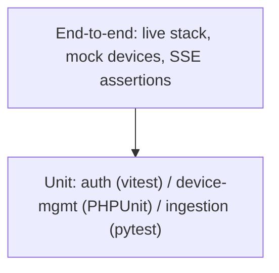

# IIoT Platform — Testing Strategy

How the platform is verified, from per-service unit tests to the full-stack
end-to-end suite.

## Test pyramid



- **Unit** — fast, no network/docker; run inside the service containers.
- **End-to-end** — boots a full isolated stack (`docker compose.test.yml`
  overlay) and drives all four device protocols with mock devices.

## Unit tests by service

| Service | Runner | Location | Coverage |
|---------|--------|----------|----------|
| `auth` | vitest | `services/auth/test/*.test.ts` | token signing/verification, refresh rotation, JWKS endpoint, key generation/persistence, seeded admin, auth routes, config |
| `device-mgmt` | PHPUnit 13 | `services/device-mgmt/tests/` | controllers (device/register/group/command/downlink/telemetry/insights/health), JWT auth (real EdDSA validation + fake JWKS), message payload serialisation, services (command routing, downlink publish, MQTT ack, event publisher, Mosquitto credential provisioning), consumer commands and handlers |
| `ingestion` | pytest | `services/ingestion/tests/` | normaliser/decoder (field types, bad payloads, LoRaWAN envelope), HTTP ingest route, MQTT client, Modbus poller, batch writer, health, Mercure publish, config |

The device-mgmt suite substitutes the real broker with
`FakeBrokerCredentialProvisioner` and a test JWKS via `JwtTestTrait`, so no
live MQTT or auth service is needed. The auth suite runs against an
in-memory/short-lived Postgres supplied by the test setup.

## End-to-end suite

`tests/e2e/run_e2e.py` runs against a stack booted from
`deploy/docker-compose.test.yml` — the production compose plus a test overlay
that adds:

- `mock-modbus` — a raw Modbus TCP (FC03) server the ingestion poller reads;
- `e2e` — the suite container (`tests/e2e/Dockerfile`), which also contains
  `lorasim.py` for the LoRaWAN leg.

The suite drives one device per protocol and asserts the **full loop** for
each: ingest → TimescaleDB → read API (`/last`, `/telemetry`) → Mercure SSE
(`/devices/{id}` live stream):

- **MQTT** — a fake device publishes `devices/{id}/up` with its provisioned
  broker credentials (username = device id, password = API key);
- **Modbus** — the poller reads `mock-modbus` and publishes `modbus/{id}/up`;
- **HTTP** — `POST /ingest/http/{id}` with the device API key;
- **LoRaWAN** — a fake ChirpStack publishes
  `application/{app}/device/{devEui}/event/up` on the broker (the EUI is
  resolved, decoded and stored as a real LoRaWAN uplink).

Timeouts reflect the poller cadence: 30 s for push protocols, 60 s for Modbus
(config reload is 15 s). The container exits non-zero on any failed check, so
`docker compose ... up --exit-code-from e2e` reports the result directly.

### Running locally

```bash
cp deploy/.env.example deploy/.env
docker compose -p iiot-platform-e2e \
  -f deploy/docker-compose.yml -f deploy/docker-compose.test.yml \
  up --build --exit-code-from e2e
```

### In CI

`.github/workflows/e2e.yml` runs the same command on every push/PR
(30-minute timeout); on failure it dumps the tail of every service log, and
tears the stack down with `down -v` in both cases.

## What is not yet automated

- No dedicated unit tests for the `dashboard` SPA (browser-level checks are
  only exercised through the e2e/SSE flow).
- No load test: ingest throughput is bounded by the batch writer
  (≤ 500 rows / 0.2 s) but no soak test enforces it.
- No explicit security regression tests (see
  [Security](iiot-platform-security.md#known-gaps-and-recommendations)).
